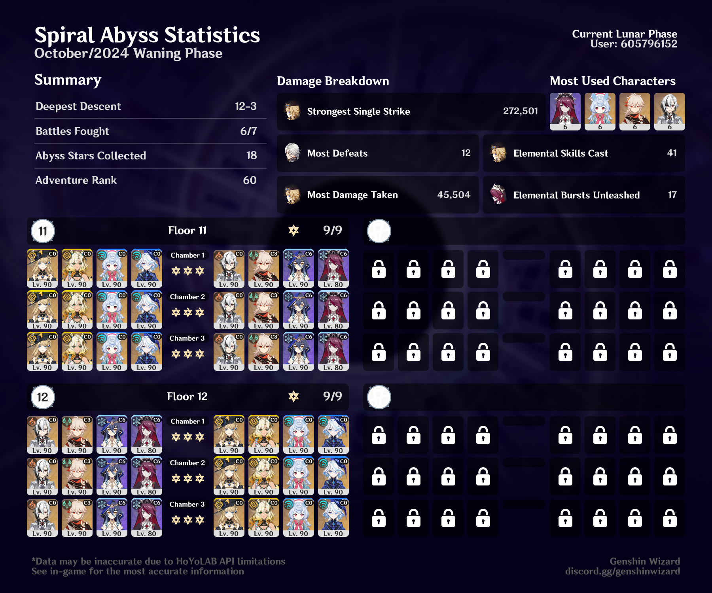

## overview

First Abyss not having to do floors 9 and 10, so the graphic is a little weird. I got 36 stars, I promise.

This felt like the easiest Abyss in a while, thanks to Navia and Xilonen. These two teams are my favorites right now — Arlecchino melt has never let me down, and Navia is crazy strong with Xilonen. Sigewinne and Furina are a great duo, too.