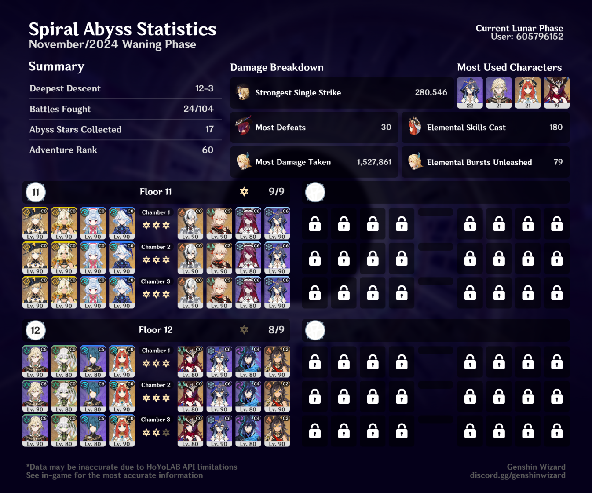

## overview

I wanted, so badly, to clear this Abyss with a Kaveh superbloom team & what has become my preferred Chasca team (with Layla, Ororon, and Dehya). And I really did come very close! But in the end, after a lot of resets, I was still just a couple of seconds away from getting that last star in the third chamber. 

That said, I'm still pretty happy with this. It was my first time using Kaveh on Floor 12, and my first time actually using Nilou in Abyss since getting her, and it was really fun! I also think the second half felt really good for Chasca — it was pretty easy for her to kinda just cheese the bosses on that side by being able to fly around and aim from far away. I know this isn't the "optimal" Chasca team, but I genuinely think it works pretty well.

Also, if you had told me a couple of years ago that I'd be clearing Floor 12 without a healer on either side, I would have laughed. Especially with consecrated beasts! But I'm a lot more confident in Spiral Abyss now after lots of practice — and it helps that Kaveh is so wonderfully tanky. 