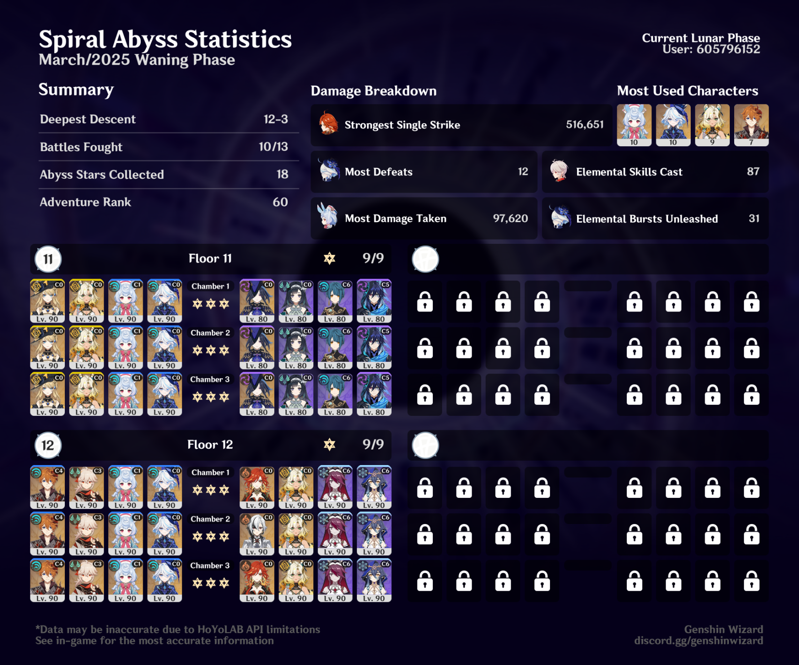

## overview

I can't say I really enjoyed this Abyss. The Childe-Kazuha-Sigewinne-Furina team I used first half was fun, but the second half was pretty rough. Maybe I'm just lazy ([turtlecamera](https://www.youtube.com/watch?v=EbWiuQT7ygo) still managed to do this one with starter characters!) but it felt like such an overt Varesa-or-Mavuika check. So I'm being a grump about it.

I can think of more than a few past Spiral Abyss versions that I didn't get 36 stars on but had way more fun doing than this one. I do like Natlan characters, and I like their special Nightsoul abilities (especially for exploring), but I don't really like the effect they're having on endgame content. I hope we move on from this soon.

I have more thoughts on Nightsoul, and how it compares to Fontaine's Arkhe system, and what I'm hoping to see in Nod-Krai or Snezhnaya — assuming they continue added region-specific mechanics, which I'm sure they will. But I'll leave it there for now. 

**tl;dr** I got 36 stars, but I didn't have fun doing it. All my character builds are on [Enka](https://enka.network/u/jillian/4CmScP/10000007/3260473/).