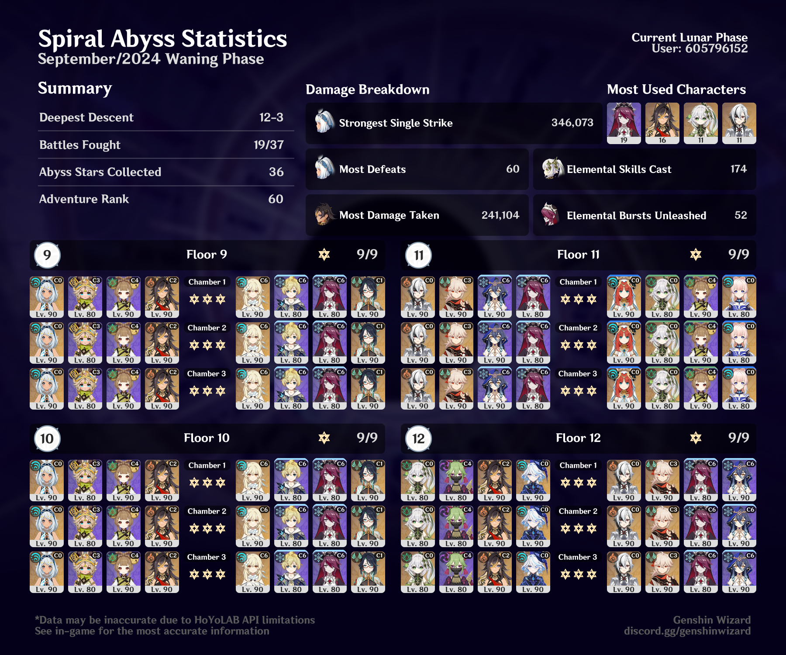

## Overview

I really wanted to get through Floor 11 with a physical Lumine team, but that turned out to be tricker than I expected — so I brought out Nilou to finish the job, since I haven't used her in Abyss since I got her in 4.8. 

I swapped Xingqiu out of my usual hyperbloom team for Dehya in the first half of Floor 12, since she's kinda been my MVP in Natlan so far. Super fun team, will definitely be using again. Dehya has really become one of my favorite characters to play with.

Second half, I used the trusty Arlecchino melt team that I think I've used in every Abyss since I got her. 