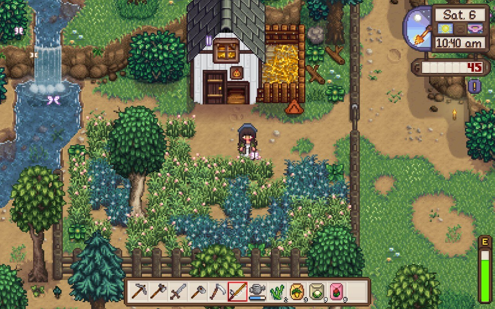

[Anh](https://anhvn.com/) told me to play Stardew Valley, so I'm playing Stardew Valley. I haven't properly touched the game in a while, and I know there's been a lot of new stuff added that I haven't seen yet, so coming back to it with a fresh save feels both familiar and new.

I started with the new [Meadowlands farm](https://stardewvalleywiki.com/Farm_Maps), which has a really interesting layout & gives you a coop with two chickens to start off with instead of a bunch of parsnip seeds. I spent a little bit of time clearing away land and getting some green beans growing right away, since I know they'll regrow all season.

My first week of Spring had all the usual getting-started stuff: I met some villagers, I got a fishing rod, I planted a few more crops when I had enough gold to buy the seeds, I got to Floor 5 of the mines and crafted a furnace, I started gathering wood to build a silo, and I checked out the community center for the first time. 

## mods
I wasn't *going* to play with mods, because I'm mostly playing on my Steam Deck where they're a little more annoying to install, and because I thought it'd be nice to have the "vanilla" experience since there's a bunch of new stuff. But I couldn't help myself.

It ended up not really being that annoying to install the mods. I downloaded all the ones I wanted on my laptop first, zipped them up into a folder, and emailed it to myself (lol classic) to download on my Steam Deck. Dragging a bunch folders around with the little trackpad is probably the most fiddly part of the whole process.

I made a list of the [mods](../../notes/mods.md) I'm currently using, and some that I'm not using but want to remember to try at some point. I'll try to remember to keep it updated. 🫡