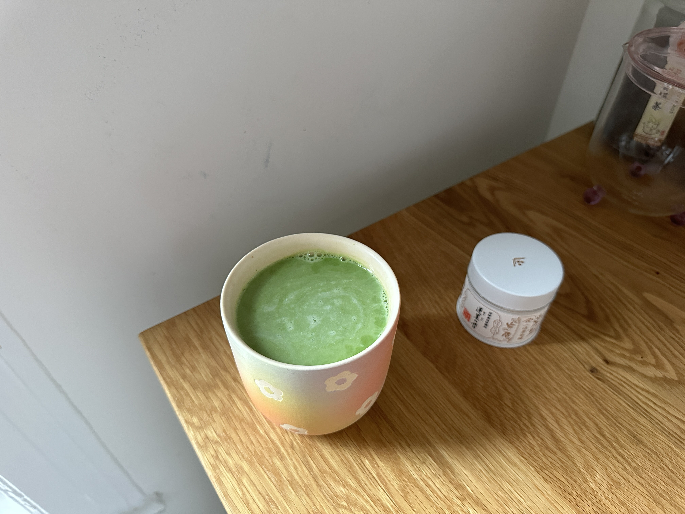
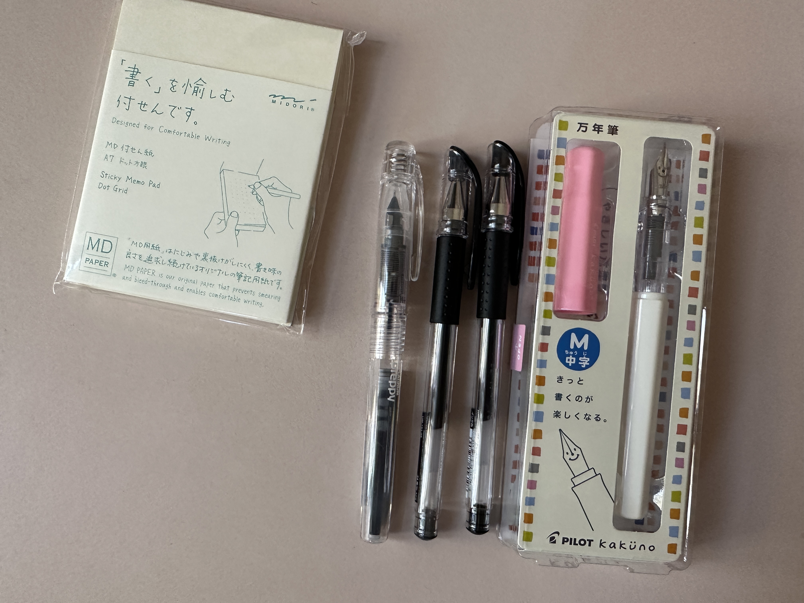
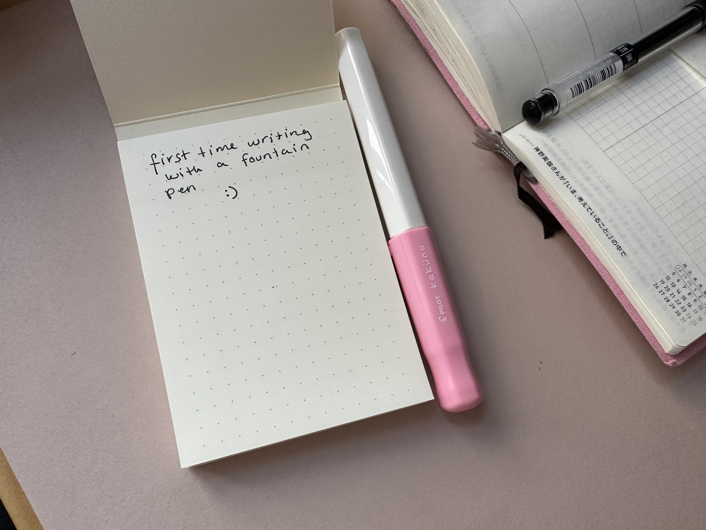

happy sunday. i got some new toys :)

i never understood the fountain pen hype because i've never actually used a good one. but i was browsing jetpens last week looking for a notebook that would change my brain chemistry (didn't end up getting one — the several unfilled notebooks i have are fine) and wandered into [a post about different kinds of pens](https://www.jetpens.com/blog/The-Difference-Between-Ballpoint-Gel-and-Rollerball-Pens/pt/167) & which one is right for you etc etc etc. (i got two of their recommended "best gel pen," the [uni-ball signo um-151](https://www.jetpens.com/Uni-ball-Signo-UM-151-Gel-Pen-0.38-mm-Black/pd/306).)

somehow from there i ended up reading "[The Best Beginner Fountain Pens](https://www.jetpens.com/blog/The-Best-Beginner-Fountain-Pens/pt/862)" & adding the [platinum preppy fine nib](https://www.jetpens.com/Platinum-Preppy-Fountain-Pen-Crystal-03-Fine-Nib/pd/24019) + the [pilot kakuno medium nib](https://www.jetpens.com/Pilot-Kakuno-Fountain-Pen-Soft-Pink-Medium-Nib/pd/12303) to my cart. so now i've got two fountain pens.

i was worried i wouldn't like them, or that i wouldn't be able to write well with them, or whatever. but they're actually really, really nice — they're so smooth & easy to write with. i get why people like these now. (there's also just something fun about having a pen that requires more care & maintenance than your average rollerball; it's like a pet.) 

the pens i steal from hotels get the job done just as well as anything else, and i can scribble notes on whatever piece of paper i have in front of me — that's all i need. but it's nice to have a little treat sometimes.