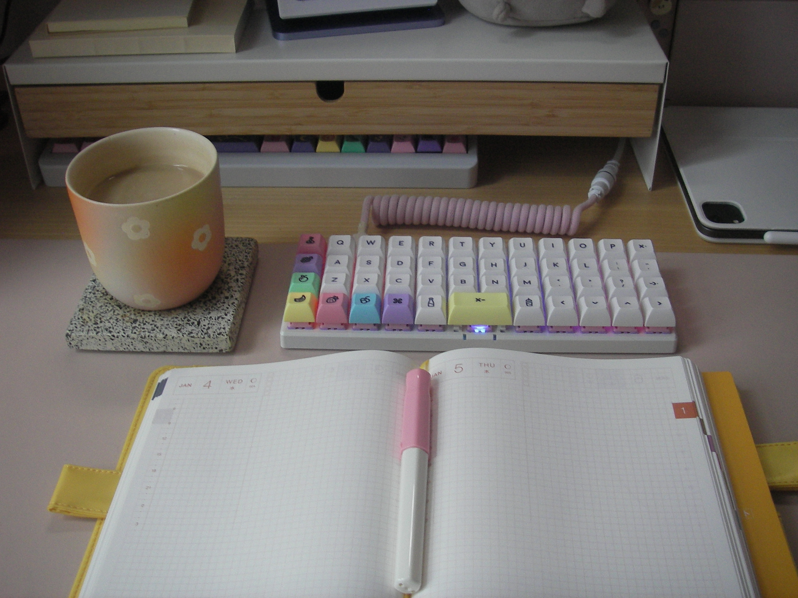

it's a thursday, but it feels like a monday. i've got a full slack inbox & and an empty new hobonichi, ready to scribble in with my [also-new pens](https://jillian.garden/blog/i-got-some-new-pens/). 

i've missed sitting at my desk! i've missed typing on my little keyboard! i've had a nice break from everything, visiting family & playing video games & giving myself permission to *not think about projects* and stuff. but it is good to be back in my regular routines, even if it feels a bit like picking up breath of the wild for the first time in months and forgetting how to take out my wind glider.

my therapist told me my routines are very important to me (she's right, and i knew that). breaks are nice, but i have a hard time feeling like a person again after going a week without getting up at my usual time & making a cup of tea first thing in the morning. i'm sure most people feel the same — i don't mean the pretty, idealized, lifestyle-bloggy *morning routines*; i just mean the things you do every day that you don't really notice or think about until they're missing. i snooze my alarm once every morning on principle, whether i need to or not. 

<3

