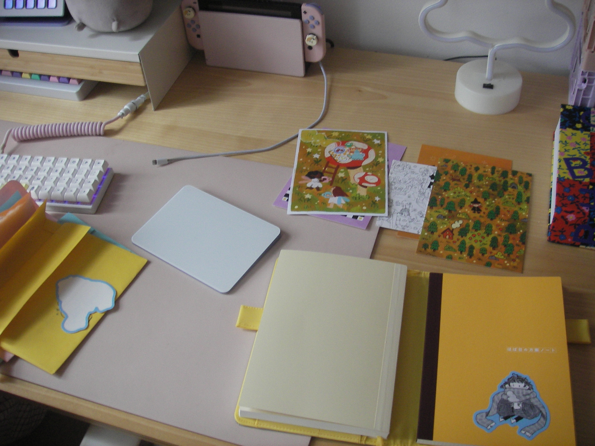
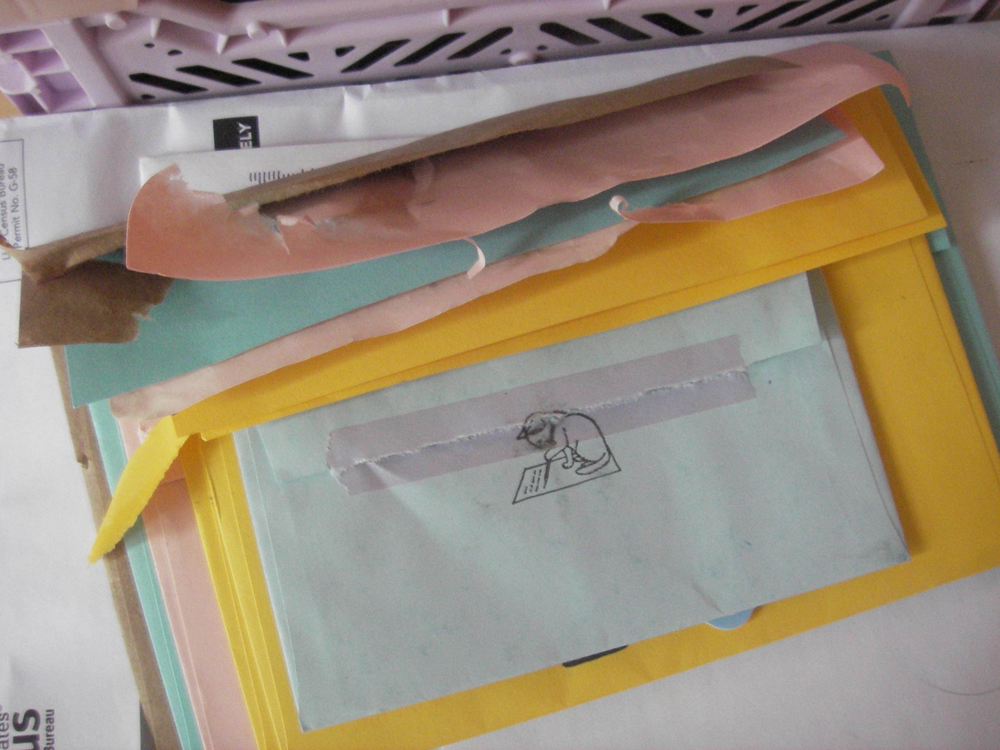
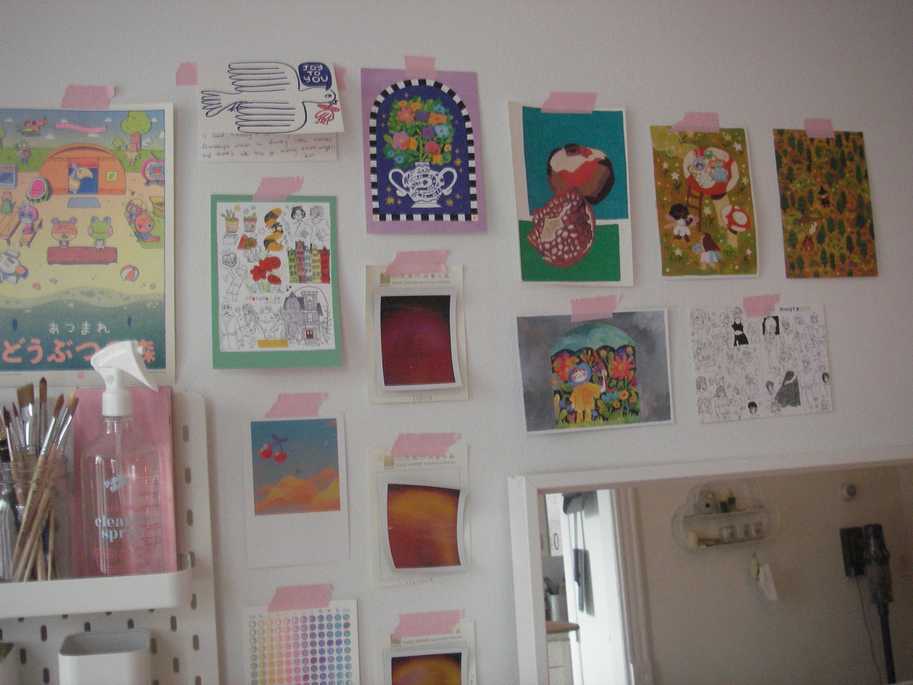

i really like saving up a bunch of mail for a bit to open all at once — not like, bills or other time-sensitive things, but fun mail. stuff like the postcards & stickers in that photo, from [cheyenne barton's patreon](https://www.patreon.com/cheyennebarton), or letters from friends. 

i spent most of my morning in bed after waking up at 6:45 to watch the 3.4 genshin impact livestream, and only got up a few minutes ago. i was supposed to go to the dmv today but the thought of going outside is sort of filling me with dread, so i rescheduled my appointment for a couple weeks later & now i have the whole day to myself. i have a bunch of little chores i want to take care of — first thing on the list was opening mail.

i had a whole backlog of things from patreon to open, plus a few holiday cards from friends that i was saving to open on a calmer day. i also got a big census envelope in the mail this week, but i'm ignoring that today in favor of the fun stuff. i'll get to it later.

today i got to add four postcards, a handwritten note that made me smile, and a painting done by a friend to the wall above my desk. i think i'm starting to run out of space, but i'll manage.