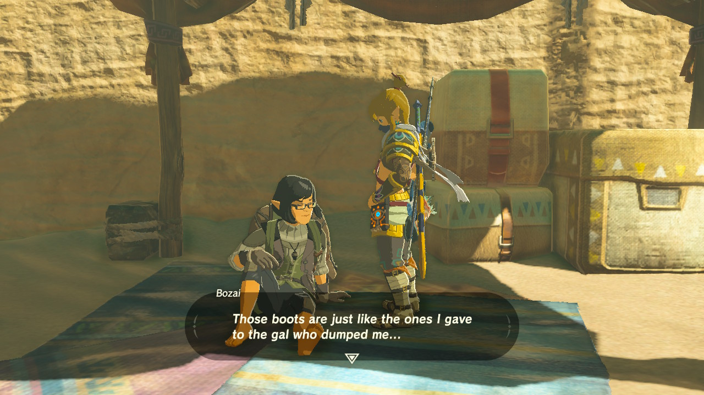
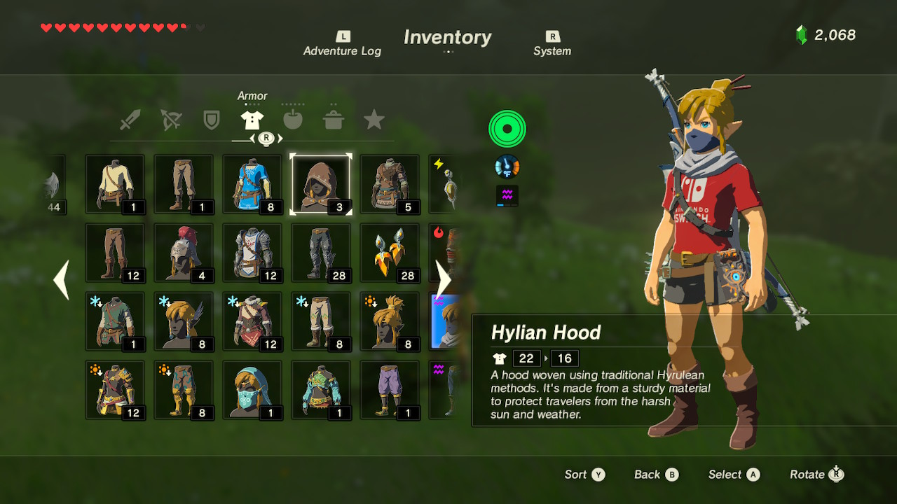
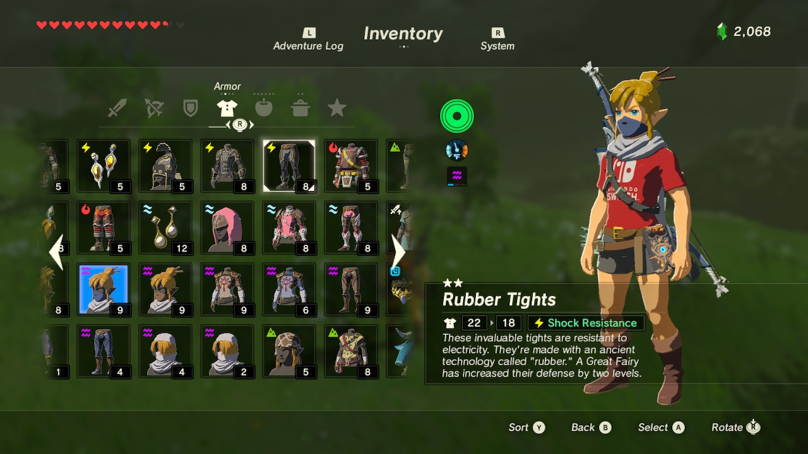
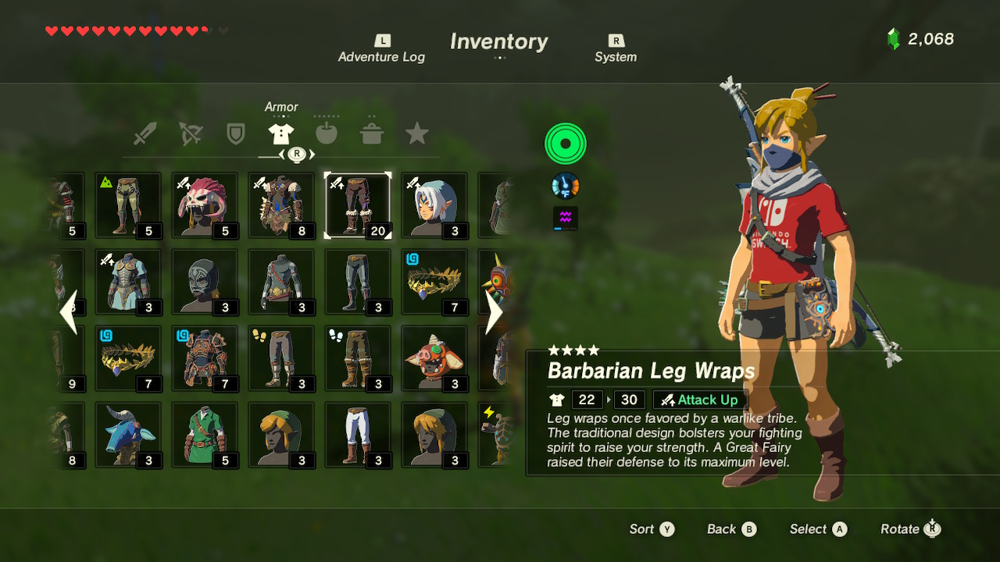
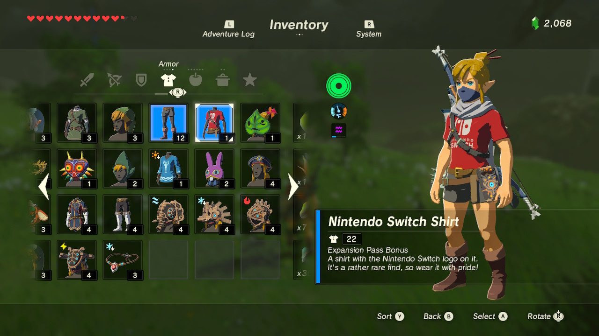

i've been in a big breath of the wild mood this week—maybe because tears of the kingdom is coming out in a month, or maybe just because i haven't played it in a while & missed it. i've still never finished the game, and with all the dlc content i probably won't be able to before totk's release, but i did come up with a goal last night: *i want to collect & fully upgrade every piece of armor in the game in 30 days.*

i'm not starting from scratch, obviously. i have most of the armor already, and most of the stuff i have is at least partially upgraded. but i don't have many fully-upgraded pieces, and there's still plenty of armor i haven't gotten yet—the armor of the wild set requires you to finish all 120 shrines, and the dark set can only be purchased after defeating all four divine beasts (i've only done two). not to mention i have a lot of guardians to fight if i want an upgraded ancient armor set. so i have my work cut out for me!!!

## day one
last night, i started by focusing on a few of the easier-to-acquire pieces i was missing. i was able to buy the ancient cuirass & upgrade it once with what i already had in my pockets, and it wasn't too hard to get enough luminous stones to buy the full radiant set. 

i realized i hadn't yet done the quests from bozai that get you the snow boots & sand boots, so i trekked into the gerudo highlands for him—and opened a bunch of chests full of gems i needed to buy & upgrade a few jewelry pieces. the only one i'm missing now is the sapphire circlet.

here's the current state of link's wardrobe after last night:

now, i've mostly just got a lot of monsters to fight for upgrade parts. 🫡