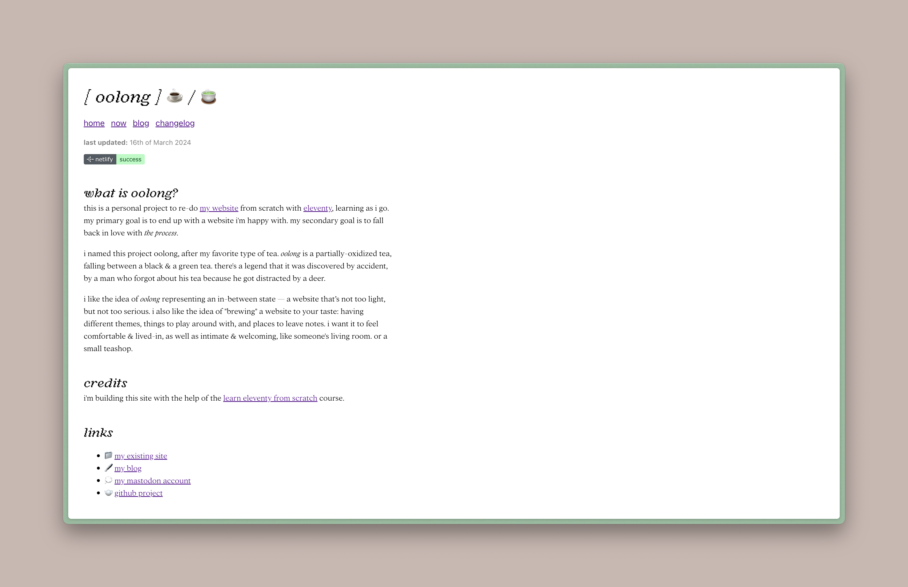

I did some other stuff too, but the fonts are the fun part. As mentioned in the [changelog](/log), I finally got around to sprucing up the place a little bit — I was getting tired of looking at a css-less website. 

As the first step of that process, I treated myself to two Connary Fagen fonts that I've had stashed away in a folder for a while: [Argent Pixel](https://connary.com/argentpixel.html) & [Addington](https://connary.com/addington.html). Once I got those all set up, I stole Andy Bell's [css reset](https://piccalil.li/blog/a-more-modern-css-reset/) to get me started. And then I wrote some very lazy, scuffed css just to quickly get everything looking a *little* nicer.

I do have aspirations of really nice, clean, efficient scss files that are organized and easy to read. But I decided when I started this project that it wasn't worth getting into the weeds with all that before I've had the chance to play around and actually figure out what I want the website to be. I'm still in the messy, experimental phase.

Oh — I also (as mentioned in [the last post](https://ooolong.netlify.app/posts/2024/03/using%20obsidian%20as%20a%20cms/)) got some more collections set up in Obsidian. So now I can make really quick updates to the [/now](/now) page by adding & editing Obsidian files for books I'm reading, games I'm playing, and other things I'm doing. 

Next, I think I want to set up individual pages for each item in those collections — each book, each game. And maybe a "shelf," so I can also list the things I've already finished or haven't started yet. And then maybe after that I'll get around to writing better css.
