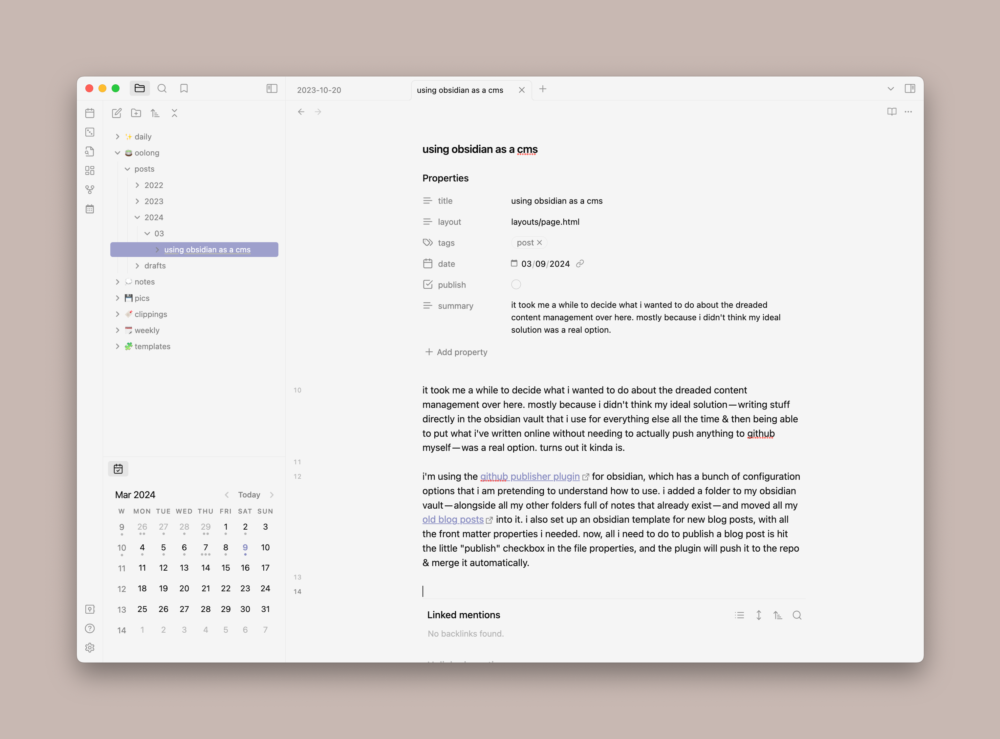

It took me a while to decide what I wanted to do about the dreaded content management over here. Mostly because I didn't think my ideal solution — writing stuff directly in the obsidian vault that I use for everything else all the time & then being able to put what I've written online without needing to actually push anything to GitHub myself — was a real option. Turns out it kinda is.

I'm using the [GitHub Publisher plugin](https://github.com/ObsidianPublisher/obsidian-github-publisher) for Obsidian, which has a bunch of configuration options that I am pretending to understand how to use. I added a folder to my Obsidian vault — alongside all my other folders full of notes that already exist — and moved all my [old blog posts](https://jillian.garden) into it. I also set up an Obsidian template for new blog posts, with all the front matter properties I need. Now, all I need to do to publish a blog post is hit the little "publish" checkbox in the file properties, and the plugin will push it to the repo & merge it automatically.

This plugin is cool, and it pretty much *is* the ideal solution I was looking for, but it's not perfect. It took me a couple of days of wrangling with both the plugin & 11ty to figure out how to get images to actually show up in posts because of file path weirdness (the solution I ended up with was making each blog post a [folder note](https://lostpaul.github.io/obsidian-folder-notes/) with another folder inside it for photos). The plugin also can't pull any content *in*, so if I were to add a post via some other method for whatever reason, I wouldn't be able to see & edit that post in Obsidian without making a brand new copy of it — not that I expect this will happen often.

## fun config stuff if you're nosy
I will not claim to be an expert on anything that's going on here, but these are the plugin settings that seem to be doing what I want:

- Since I want the file structure to stay the same as it is in my Obsidian vault, I have **file tree in repository** set to **Obsidian path**. I'm also using the folder path name replacer — the name of the Obsidian folder I'm using is `🍵 oolong`, but the plugin very politely pretends that it's named `src` so everything will end up in the right place.
- I have **folder notes** turned on, so each blog post is in its own folder — the folder is named with the blog post title, and the post itself is just "index.md," which is what 11ty was already doing. For whatever reason, this is what fixed the issue I was having with images not showing up.
- I have **internal links** and **wikilink → mdlink converting** turned on but I don't actually know what that's doing because I haven't tested it. I suspect I'm gonna have to play around with it to get it to work, but it's not like I'm using a lot of wikilinks here.
- I have **transfer attachments** turned on — this is so anything that's not a markdown file that gets linked *in* a markdown file (e.g. an image in a blog post) also gets published. I also have attachments set to use the Obsidian structure, so they stay in the folders I put them in rather than all getting sent to the same place.
- I changed my share key to "publish" rather than the default "share" because I like that better.

So that's what i've been tinkering with this weekend. Right now, it's just set up for blog posts, but I want to try using this method for other types of collections — books I'm reading, games i'm playing, etc. 