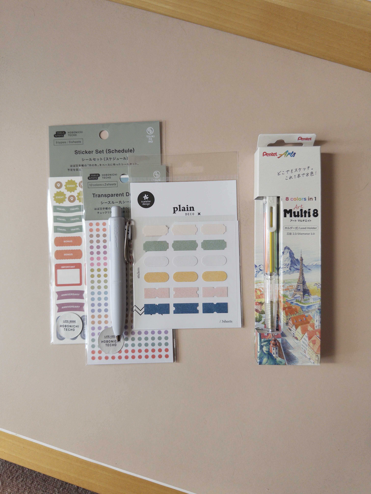
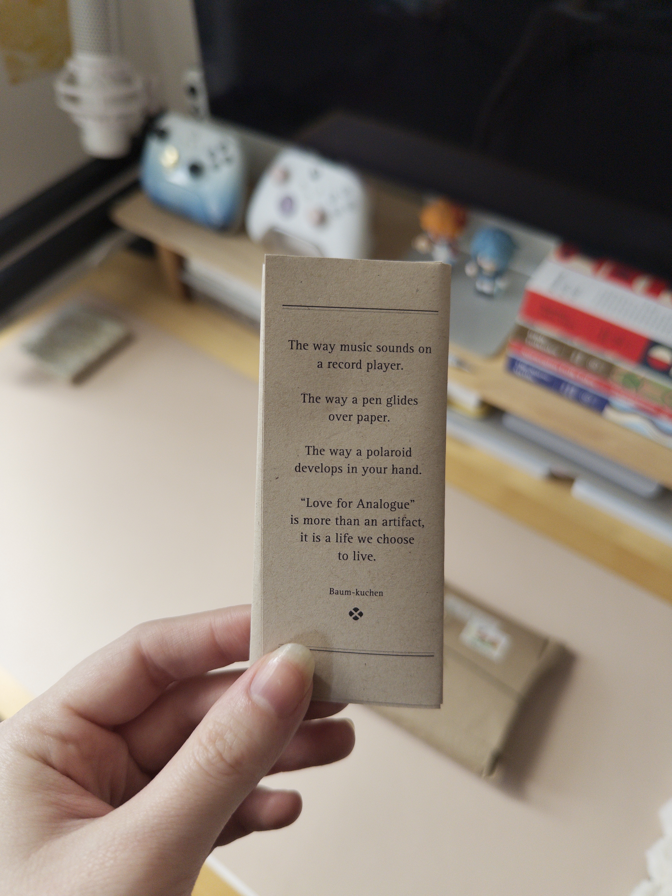

I got new stickers for my journal, but now I have decision paralysis. I assume all sticker-havers are familiar with this feeling — you get stickers because you want to use them, but if you use them, you won't have any stickers left to use. It's not that I don't know what to use my new stickers for; I just want to make sure I use my finite supply effectively. 

I got over it by the end of the week. Now, my weekly and daily spreads are more fun and colorful. Now, I feel like I'm actually *using* my journal. 





I got the stickers (along with a [Uni-Ball One](https://www.baum-kuchen.net/collections/uni-ball/products/uni-ball-one-p-gel-pen-0-38mm) and a [Pentel Multi-8](https://www.baum-kuchen.net/products/pentel-art-multi-8)) from [Baum-Kuchen](https://www.baum-kuchen.net/). I love their [blog](https://www.baum-kuchen.net/blogs/analogue-stories), and they have a nice selection of stuff. The packaging it came in was so cute, and came with a little bookmark wrapped up in a lovely note.





Went to Red Hook Tavern for a very late dinner on Sunday night. The burger was crazy, the steak tartare was the best I've ever had in my life, and the negronis and wine were delicious. Very cozy vibes, want to go back.

### things i'm doing
- I started playing [Marvel Rivals](https://jillian.garden/shelf/games/rivals/) about a month ago — it really got me! I've been playing so much of it lately. I avoided playing ranked games for a while, but finally gave it a shot for Season 7, and I've (so far) managed to get to Platinum III. My goal was just to get to Gold, so I'm very happy with that.
- Another sort-of new game for me: [Reverse: 1999](https://jillian.garden/shelf/games/r1999/). This has replaced almost every other gacha for me (aside from [Genshin](https://jillian.garden/shelf/games/genshin/), which is still my favorite). 
- Been reading [Invitation to a Beheading](https://jillian.garden/shelf/books/invitation-to-a-beheading/). I like it, but I don't think I love it. I recently finished [If On a Winter's Night a Traveler](https://jillian.garden/shelf/books/if-on-a-winter's-night-a-traveler/), which kind of blew my mind, so I'm more lukewarm on this one.

> [!NOTE] shhh
> We don't need to talk about how I haven't written a blog post (let alone weeknotes) in a while. If I don't write another one for a long time after this, that's cool. I just felt like it today.

