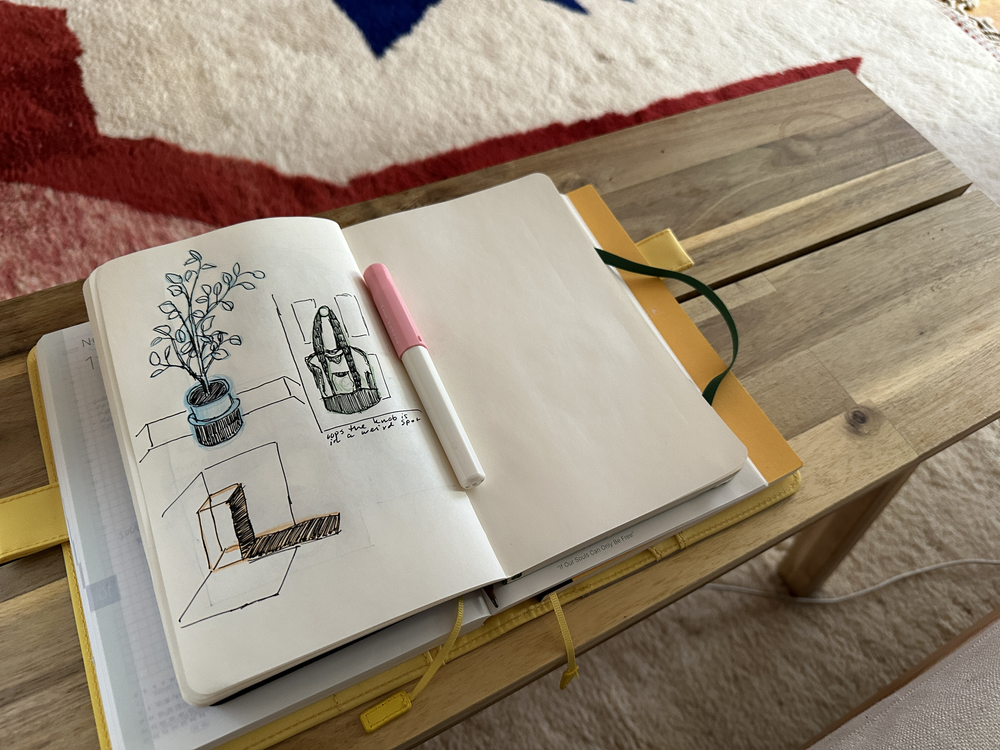

i'm going to copy [anh](https://anhvn.com/posts/2023/weeknotes-revival/) — i've been thinking about [weeknotes](https://interconnected.org/home/2018/07/24/weeknotes) lately, and about why i don't write here very often, and about how i could change that. it's easier not to write than to write, and writing in public is a little humiliating in a way that private journaling escapes. but i've managed to build up the habit of journaling, so maybe i can do this, too.

i go back and forth on this: i sometimes feel annoying and useless taking up space "[on-line](https://sleepy.cool/@jillian/111387332195020722)," like i'm whining and begging everyone to *look at me! i'm here!* — like the only way i'm allowed to post is to share something interesting i worked on, and the rest of me has to live in the shadows. 

<iframe src="https://sleepy.cool/@jillian/110640077909599491/embed" class="mastodon-embed" style="max-width: 100%; border: 0" width="400" height="300" allowfullscreen="allowfullscreen"></iframe>

but i know that's not true. i know that i like to fill my feeds with tiny life updates and silly thoughts from people i follow, even people that i barely even know at all. i love when [i have no idea what anyone is talking about](https://sleepy.cool/@jillian/111356009288566081). i love browsing [ooh.directory](https://ooh.directory/) for blogs i never would have known existed, and filling my rss feed with inconsequential posts that nonetheless make me happy to read. i want more of that, so maybe i have to be part of making more of that. 

### what i've been up to
i've been sketching more — in an actual sketchbook, with actual pens and pencils. i like doodling in procreate, but something about sketching on paper feels better. even though it's harder to correct things i'm not happy with, and even though i have far less freedom & flexibility with materials, i like what i make in my sketchbook far more than anything i make on my ipad. 

because of that, and because we're nearing the end of the year, i've been thinking a lot about notebooks and planners. i still haven't decided if i want a new hobonichi for next year or if i want to try something else. i really don't need a planner, much less a daily one, but i still *like* having them. i do have some idea of what my ideal notebook would be, and the modularity of [the traveler's notebook](https://travelerscompanyusa.com/travelers-notebook-story/) comes pretty close — so i might try that out.

#### watching
after years of curiosity, i started watching [outlander](https://www.imdb.com/title/tt3006802/) on halloween — which was kind of perfect, because the first episode takes place on samhain. i immediately loved the vibes. i've watched about half of the first season, and i'll probably continue watching it for a bit, but i don't know if i'll be able to hang on for seven seasons.

i also saw [the killer](https://www.imdb.com/title/tt1136617/), which i didn't think was very good. it definitely looked & felt & sounded like a fincher movie, but the story was lacking compared to everything else he's done. i would rather just rewatch the social network for the 300th time.

#### playing
genshin's 4.2 patch just came out, and i stayed up embarrassingly late to play the entire archon quest in one night after pulling for furina and her weapon. i've *really* loved the whole fontaine arc, and i think act v wrapped it up so well — furina is easily my favorite archon. 

and to brag for a second: i managed to get 100% exploration on the existing fontaine map before 4.2 was released, i got the fontaine wings, and i also finally hit 1000 achievements this week. i have really played a stupid amount of this game.

as for the other hoyoverse games, i finished the latest trailblaze mission in honkai: star rail last night, just a few days away from a new update. and i finally started honkai impact: 3rd this week — so far, i have no idea what i'm doing, but the story is really interesting to me. i wanna know the lore!!!

#### reading
i just reread sophocles' [ajax](https://classics.domains.skidmore.edu/lit-campus-only/primary/translations/Sophocles%20Ajax.pdf), a play i never expected to love as much as i do. i feel like every time i read it, i get something new out of it.

> Skamander river  
> hostile to the Greeks, 
> there is one man your water 
> will not mirror 
> again
> 
([ajax](https://classics.domains.skidmore.edu/lit-campus-only/primary/translations/Sophocles%20Ajax.pdf), sophocles)

[an issue of spencer chang's newsletter](https://spencerchang.substack.com/p/believing-in-believing-in-people) from all the way back in february made its way into my queue recently, and i really loved reading it. makes me want to be a more curious, friendly, open person.

> I want to believe in people. I want to believe that I still believe in people.
> 
([believing in believing in people](https://spencerchang.substack.com/p/believing-in-believing-in-people), spencer chang)

i've also been thinking + reading a lot about chess lore recently:
- [chess in literature](https://bookriot.com/chess-in-literature/)
- [chess, unlike war, is a game of perfect information](https://daily.jstor.org/chess-unlike-war-is-a-game-of-perfect-information/)
- [the development of the chess motif in victorian fiction](https://victorianweb.org/authors/bronte/abronte/chess.html)
- [the symbolism of chess](http://www.studiesincomparativereligion.com/public/articles/The_Symbolism_of_Chess-by_Titus_Burckhardt.aspx)
- [scash d'armor](https://www.chess.com/forum/view/chess-equipment/scash-darmor-english-translation)

---

that's all. happy friday. going to go make another cup of tea and clean my apartment. seeya!