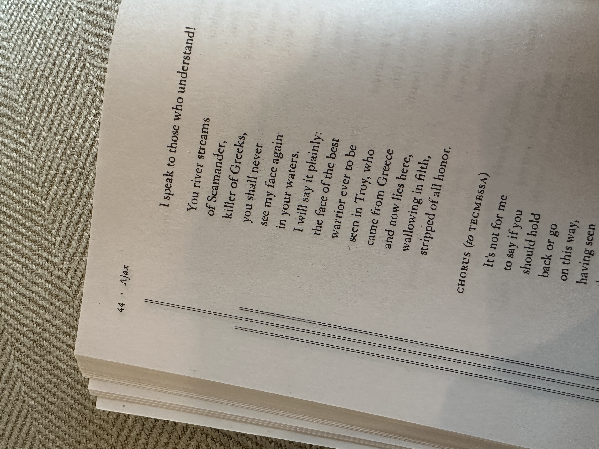
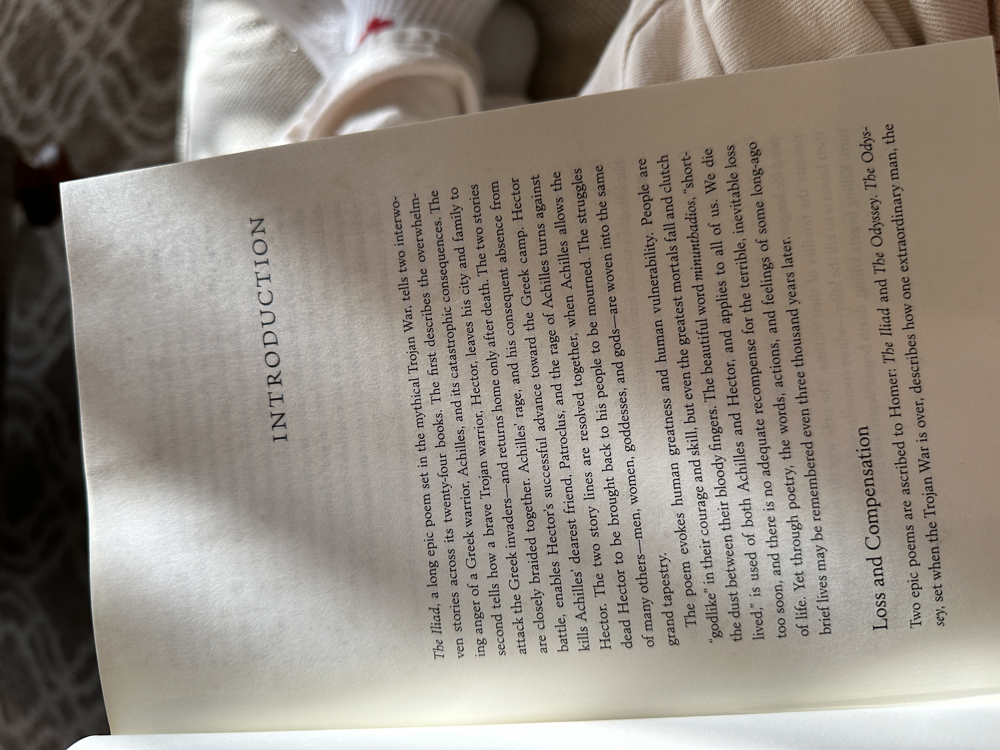

Happy [dead week](https://www.theatlantic.com/family/archive/2021/12/christmas-new-years-dead-week-romjul/621098/). 
## what i'm up to
I started the Greek [Duolingo](https://www.duolingo.com/profile/jilliangmeehan) course this week. While I'm not particularly good at keeping my Duolingo streak, I *do* like to pick up new courses every once in a while to see what's up — I mainly focus on learning Mandarin, but I've started at least five others just for fun. 

I just find it really interesting to check out the beginning of different courses, especially when there's another alphabet involved — regardless of how much Greek or Korean I ever end up learning in my life, I think there's something to be said for having a basic understanding of how their alphabets work & how to pronounce things. 

I also, as you [may have already seen](https://jillian.garden/122623), started slowly rebuilding my website from scratch. And I'm having fun.
## reading
I finally got a copy of Emily Wilson's new translation of [The Iliad](https://bookshop.org/p/books/the-iliad-homer/17147944?ean=9781324001805) and have been slowly making my way through her (fantastic, imo) introduction. I also spent Christmas morning reading Bryan Doerries' translation of Ajax in [All That You've Seen Here is God](https://bookshop.org/p/books/all-that-you-ve-seen-here-is-god-new-versions-of-four-greek-tragedies-sophocles-ajax-philoctetes-women-of-trachis-aeschylus-prometheus-bound-sophocles/9802252?ean=9780307949738), which I loved. I'm excited to read the rest of the plays in this collection.

## playing
A year after I originally started playing FFXIV, I'm finally about to finish the Seventh Umbral Era quests. I also recently got an Analogue Pocket (!!!) and have been playing Castlevania: Circle of the Moon & Fire Emblem: the Binding Blade — both for the first time.

I picked up [Roadwarden](https://store.steampowered.com/app/1155970/Roadwarden/) from the Steam winter sale and then played it for four hours straight until I had a headache from reading a lot of tiny video game text on my Wteam Deck in the dark without moving. it's so good.
## watching
I saw [Napoleon](https://www.imdb.com/title/tt13287846/) a few weeks ago — I wish it had committed more to being one of the several different movies it was trying to be all at once. To make up for it, I really want to find time to see [Maestro](https://www.imdb.com/title/tt5535276/) & [The Boy and the Heron](https://www.imdb.com/title/tt6587046/) sometime soon.

I haven't really been watching any new tv shows, but I did decide (after watching [this video](https://www.youtube.com/watch?v=J-piNPoWoYc&pp=ygULZHJldyBnb29kZW4%3D)) that i want to watch [Andor](https://www.imdb.com/title/tt9253284/). I've also been hearing a lot about Doctor Who again lately, which is kind of making me want to get back into it. 