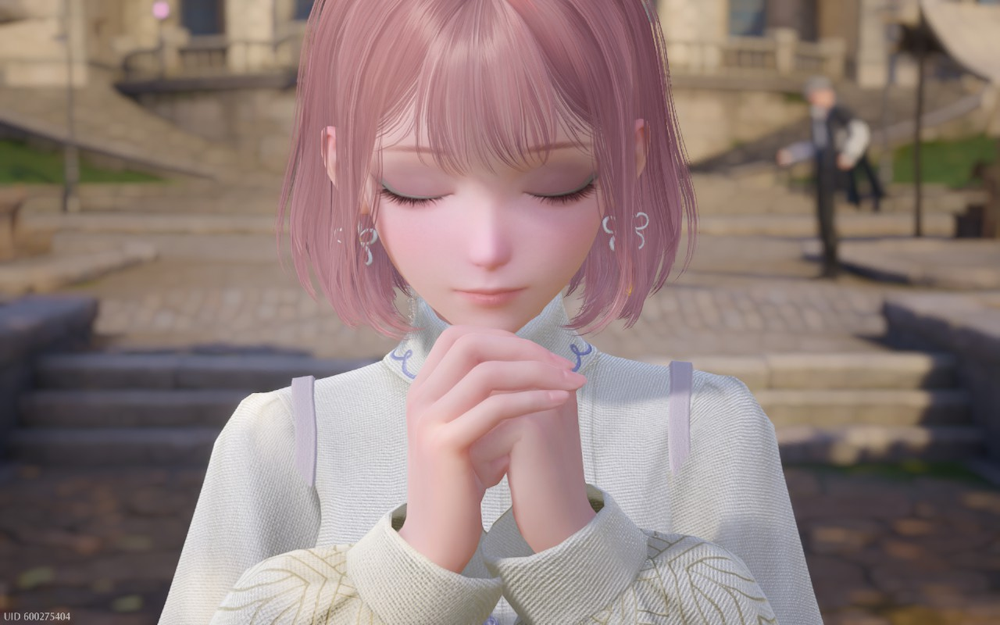

It's been a while. Excuse me while I clear away the digital cobwebs.

## what i've been up to
After my last two days of work for the year, I spent my week ruining my sleep schedule and playing video games on my couch with Junie sleeping next to me on a cozy blanket. I also kinda blacked out for a day and made a bunch of changes around here — [changelog](/log) if you're interested. The tl;dr is: the website is still kind of a mess, but at least the things piled up in the corner are stacked *neatly.* The baseboards are dusty but the dishes are done, etc.

I'm trying to ignore the classic holiday break anxiety that *I'm not being productive enough with my vacation!* Dylan's coming home from a work trip today, so I'm excited to spend the weekend hanging out with him for a bit before heading home to see my family for Christmas. And then I'll have another week or so to fix my sleep schedule and catch up on YouTube videos I've been meaning to watch.

## playing
I'm still playing all the usual stuff (mostly [Zenless Zone Zero](../../../games/playing/Zenless%20Zone%20Zero/index.md), because they just added it to Geforce Now & the latest update has been really good). Having time off means I can dedicate more energy to just *catching up* on stuff — playing a bunch of live games at the same time is hard, lol. Unfortunately, I love them!

### infinity nikki

I wasn't going to play Infinity Nikki, but I caved and downloaded it onto my Steam Deck to check it out this week. My favorite part of any RPG is finding & upgrading armor — and this is basically a game about exactly that, but the armor is cute clothes. 

I had fun playing it for a day and satisfying my curiosity, but I'm probably not going to play much more of it for now. I'm glad it's there if I'm in the mood, but I'm not super interested in playing it on a regular basis right now.

### inbento

My friend told me about [this puzzle game](https://store.steampowered.com/app/1567440/inbento/) recently — it's cute, satisfying, and not too complicated! I've gotten to the ninth level so far, and I like that I can just pick it up and play a little bit of it quickly & casually. I want to play more games like this.

(Looks like they also have a [mobile version](https://apps.apple.com/us/app/crunchyroll-inbento/id6457262278), btw!)

### kingdom two crowns: call of olympus

I played a bit of [Kingdom: New Lands](https://store.steampowered.com/app/496300/Kingdom_New_Lands/) over the summer and liked it a lot, but haven't touched it in a while. I remembered seeing at the time that they had another version of the game, [Kingdom: Two Crowns](https://store.steampowered.com/app/701160/Kingdom_Two_Crowns/), so I picked it up — and then let it sit on the shelf for a bit.

I don't really know what the difference between the two games is, but Two Crowns has a bunch of DLCs that are basically reskins of the game in different settings ("Norse Lands," "Shogun," etc). All this to say: I stayed up *way too late* last night working my way through the Artemis island in the Call of Olympus version. And now I'm going to stop writing this so I can go play some more of it.