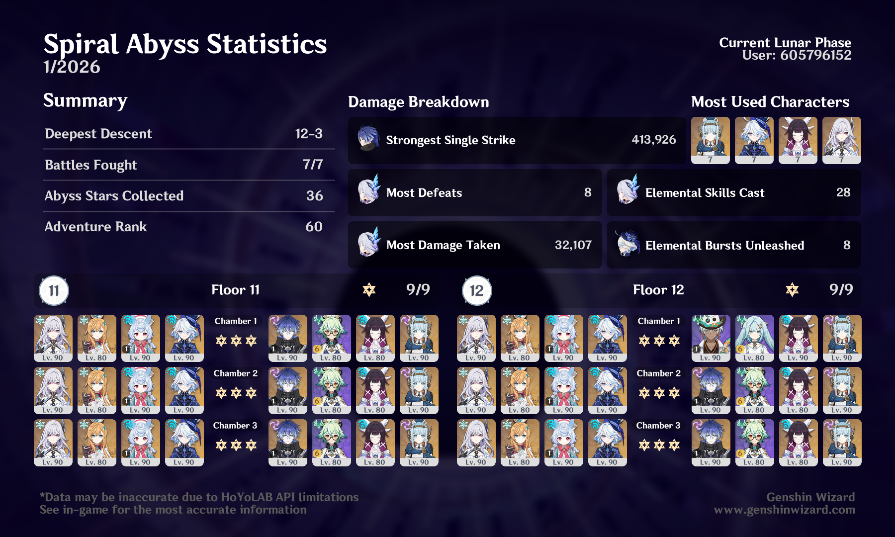

## overview

With the Skirk team in one hand and the Flins team in the other — now with Columbina! — Abyss is very easy. I never pulled Neuvillette back in the day, and I got Mavuika but no Citlali, so while I can't say I've truly struggled with Spiral Abyss for a long time, this type of breezing through it is newer to me.

As a bonus, you can see that I decided to try out Ifa with Ineffa + Bina after I had already cleared. Those two can probably carry anyone right now, but it was particularly fun using Ifa since I've given his build a lot of love and don't get to use him a lot. I should do Mizuki next! (If I didn't have Flins, I'd probably be using the two of them more, but I love my C1R1 Flins too much.)