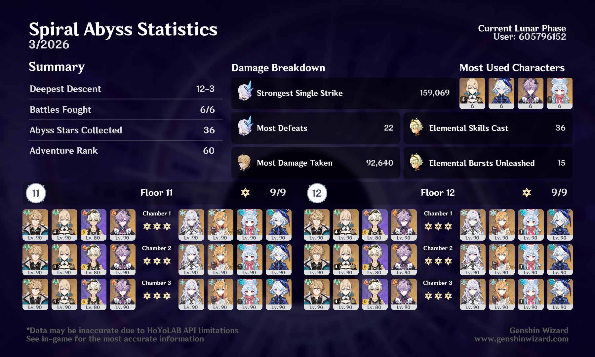

## overview

I feel like I need to start using four-star-only teams in Abyss to give myself more of a challenge. But at the same time, I do sometimes just want to have a quick, easy clear. 

I just miss when Abyss chambers were always full of consecrated beasts or like, a wave of Chasm knights followed by two Abyss Lectors. Those chambers were annoying and frustrating to me at the time, but much more fun to struggle with, in hindsight.

I'm happy with Varka — I know plenty of people have been doomposting, but I think he's fun to play! And I enjoy the weird puzzle of putting together teams for him that have two Anemo + two PECH + two Hexerei units (although I understand why someone might dislike that). 

More than anything, this patch has made me really hope our next known Cryo character (Lohen) is good enough to give Escoffier a run for her money. I'm happy that Cryo is getting its moment in the sun, but I really don't like that it feels like you either need to have Escoffier (and/or Skirk) or suffer. And Varka in particular could use a good (hopefully Hexerei) Cryo teammate, because double-Cryo teams feel quite a bit worse than double-Pyro or double-Electro right now.