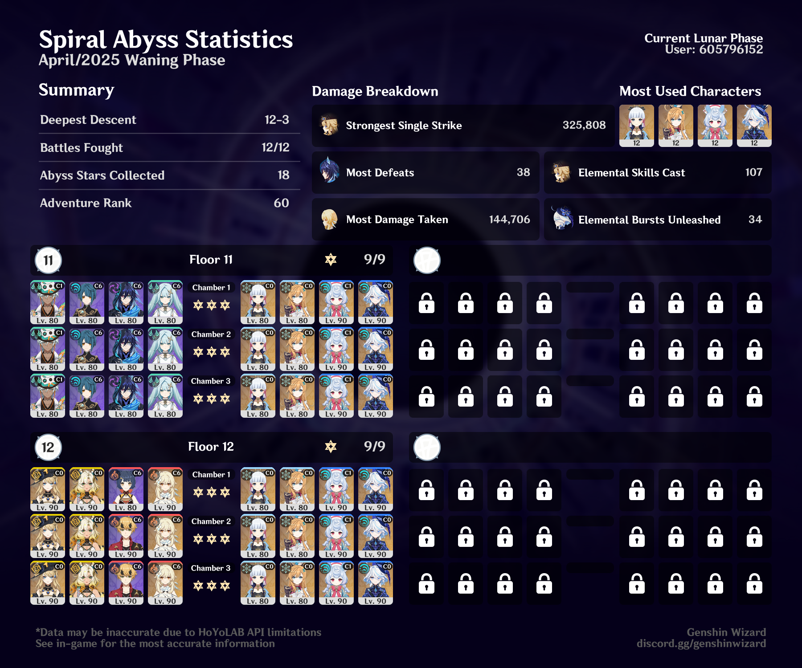

## overview

I'm writing this a little late, so I don't totally remember what was going on with this Abyss anymore, but I know I had the most fun with that Ifa team on Floor 11. I love playing Ifa, and I love electro-charged teams, and this one is *so* fun.

This was the first Abyss I did with Escoffier, and it was really nice bringing Ayaka out of retirement! 

## builds
Most of my builds are on [Enka](https://enka.network/u/jillian), although I think I still had Escoffier on some weird 2pc 2pc atk build at the time I did this. I know some of Ifa's artifacts weren't fully leveled, too.
