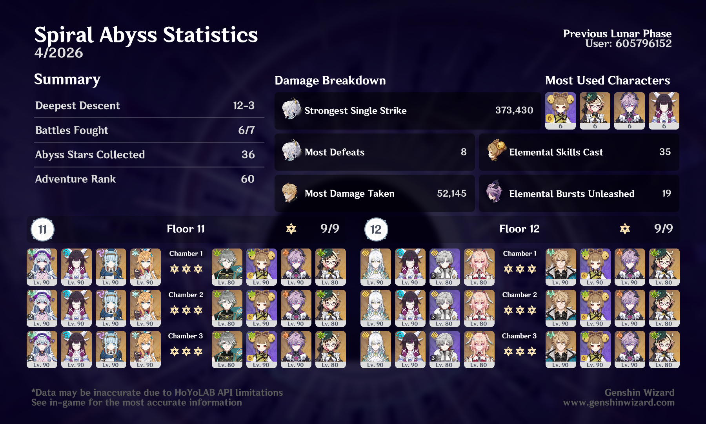

## overview

The Zibai team is obviously really powerful now with Linnea, so I probably could have used any team on the second half and done well. I like when I have an excuse to use Emilie, though!

Also tried to use some *slightly* unconventional teams for Floor 11 — Superconduct Bineffa with Mizuki was really fun, and bringing Alhaitham out to drive the Burning team gave me a good excuse to use him since he's kinda been gathering dust.