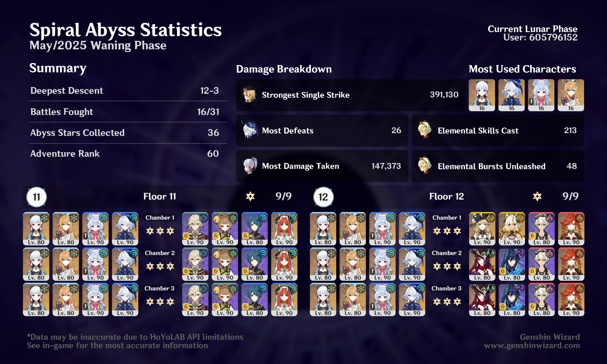

## overview

Still feels good to be playing Ayaka again, thanks to Escoffier! I finally got Escoffier on a full Golden Troupe set. This team basically blew through the first half.

I struggled a lot with the Lava Dragon Statue on the second half of Chamber 1 — I don't have Kinich or Emilie, who would have been the clear winners here. I got pretty close a few times with some combinations of Alhaitham, Pyro Lumine, Yaoyao, Xiangling, Arlecchino, Kazuha, etc. But the Navia-Xilonen core turned out to be the easy ticket! I probably could have substituted Mavuika with Pyro Lumine there, but I was getting lazy.

That team wasn't going to work very well for the other two chambers, so I brought out Chasca for the Mimifloras and Papilla. I don't normally go double-pyro with Bennett on that team, but it was too annoying trying to get past Chamber 1 with cryo or hydro.

## builds
Most of my builds are on [Enka](https://enka.network/u/jillian), although I did move weapons around a bit this time. Ayaka was sometimes on Mistsplitter, sometimes on Skyward Blade (I actually prefer her with the latter for the ER). I think I put Ororon on Elegy. And Bennett, who's usually on Skyward, was on Aquila because I got a little desperate in the end.