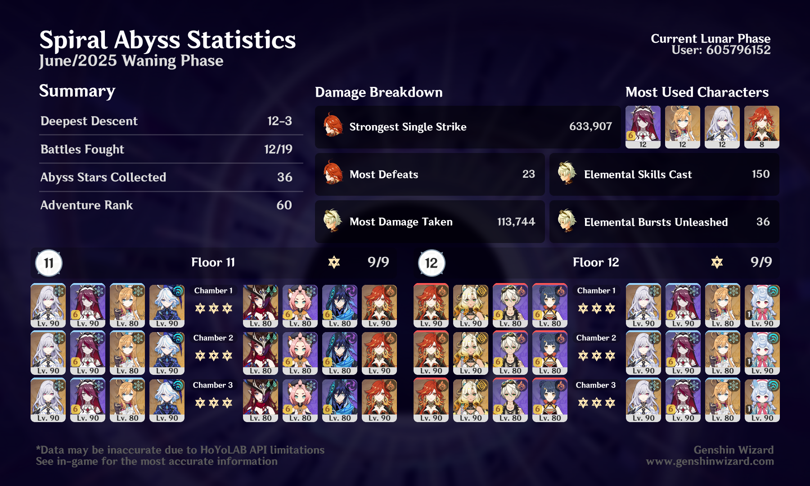

## overview

I struggled most with the first half here — *especially* with Kongamato. That guy is a real sponge. I originally tried using Navia instead of Mavuika there, but I just couldn't get three stars in 12-2. I guess the "When characters have 0 Energy, DMG + 75%" ley line disorder really made a difference (🙄).

Second half, I actually meant to use Furina instead of Sigewinne in the last slot, but I misclicked and decided to just commit to it. Close enough! My preferred Skirk team is actually Escoffier/Sigewinne/Furina, but I used Rosaria here for some extra cryo + the crit rate buff.[^1]

> [!note]
> Now that it's been a few cycles with these new Floor 12 ley line disorders, I think I can confidently say I don't like them — at least, if they're going to be this obviously specific in catering to the characters that are already the strongest in the game. I like the second half's disorder ("Characters' Normal Attack Cryo DMG increased by 75%") better, because it's a nice general buff that a lot of characters can make use of, but I'd still rather do without it and just fight less-tanky enemies. 

[^1]: I have Skirk on Finale of the Deep Galleries for the drip, and I'm really happy with the set I've built for her. But because she *always* has 0 energy, that set gives her constant buff arrows, which is so annoying to look at constantly when I'm just running around. So I think I'm unfortunately gonna have to switch her to MH at some point.
