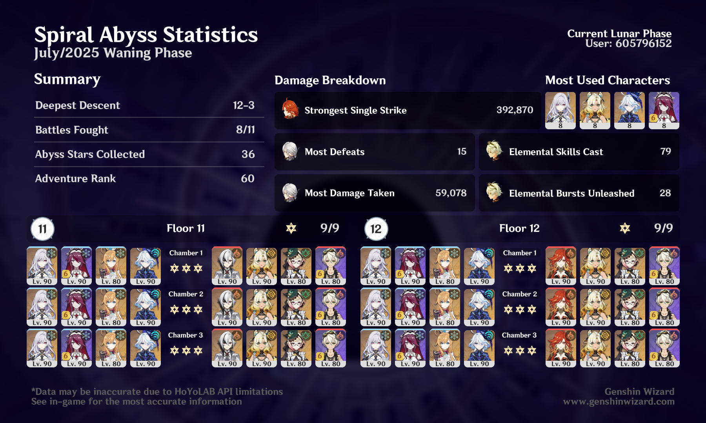

## overview

Everyone's been saying this Abyss is really easy, and it is — I basically breezed through it. I wonder if they just wanted to give us an easy one to accompany the release of Stygian Onslaught or something.

I did originally try to go through Floor 12 with Arlecchino instead of Mavuika, and it was fine until I got to Chamber 3 and was just a few seconds short of three stars. She probably could have done it with a vape or melt team, but I wanted to use my new Emilie, so I just gave in and brought Mavuika. Hitting almost 400k without even doing a reaction is crazy.

## future thoughts
I'm excited about Ineffa, and curious to see what the rest of the Nod-Krai cast's lunar reactions are like. I'm also hopeful that this next year will feel a little more balanced — in the sense that they might not build *everything* around lunar reactions like they did with Nightsoul, because we'll also have so many new characters who aren't from Nod-Krai.

If they give us a free four-star character who can enable lunar reactions, or give the Traveler some new lunar abilities (I hope so!), that should theoretically open it up to the entire existing roster in a way that is more effective than just giving us one free character like Kachina who can do a bit of her own Nightsoul damage. I also hope that, if Lunar Traveler is a thing, we don't have to wait until halfway through the nation to unlock them.

As for what Lunar Traveler might look like — I would love for them to get some kind of element-agnostic buff where all of their reactions are lunar reactions, but I wouldn't be surprised if it's specific to Hydro Traveler. We got a whole second set of constellations for Pyro Traveler that only work in a specific situation, so maybe Nod-Krai will give us a second set of Hydro constellations related to lunar reactions.