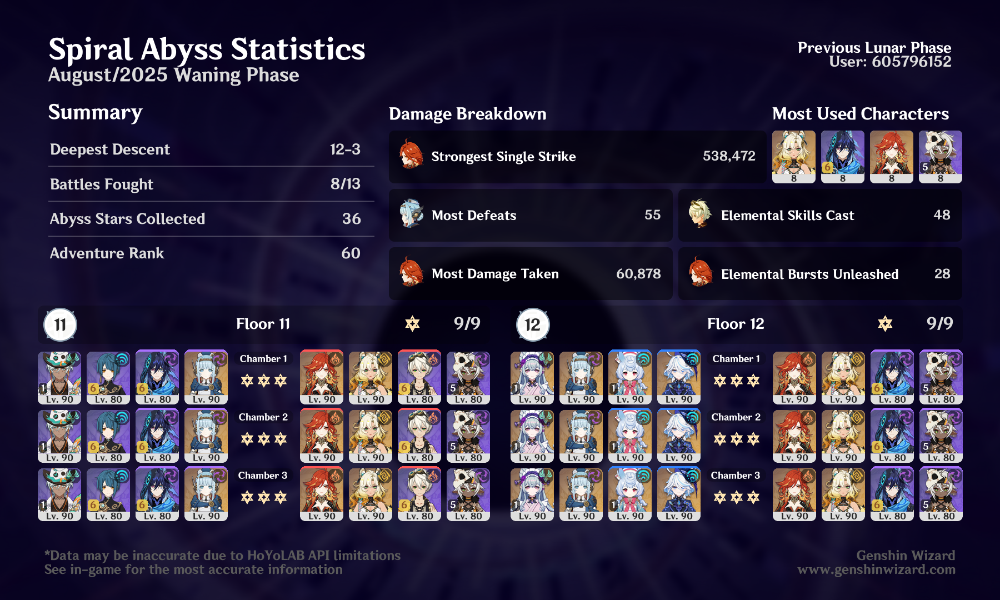

## overview

I'm uploading this late, so I don't really remember what my thoughts were when I did this Abyss. But I do know that I love Ineffa, and I love that I can play her with both Ifa and Mizuki teams and do well. 

The Mavuika team I used on the second half was the same team I was using in Stygian Onslaught at the time, so I got really used to playing them together. I'm not usually into Overload teams, but they do quite well.
