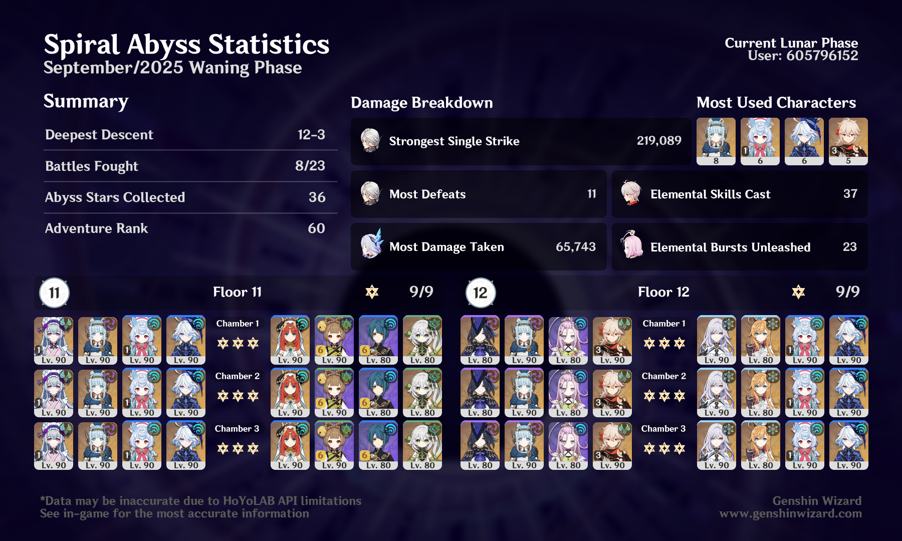

## overview

This Abyss took me a lot of tries because I kept trying to use a Nilou team on the second half of Floor 12 and it just wasn't working out. I think I also tried Arlecchino at some point, but it was too AoE-focused for her. The Skirk team ended up being a really easy ticket.

I'm really enjoying Clorinde on this Ineffa team right now while I wait for Flins! Also still a big fan of Aino, so I hope I manage to get a few of her constellations soon.