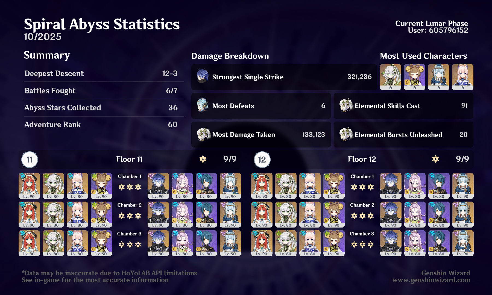

## overview

Second half was easy peasy with Flins and Ineffa. First half wasn't too bad with a Nilou team, but I struggled a little more there. It was fine since I had the luxury of really quick second-half clears, but this Abyss probably would have been tough without any Nod-Krai units at all. 