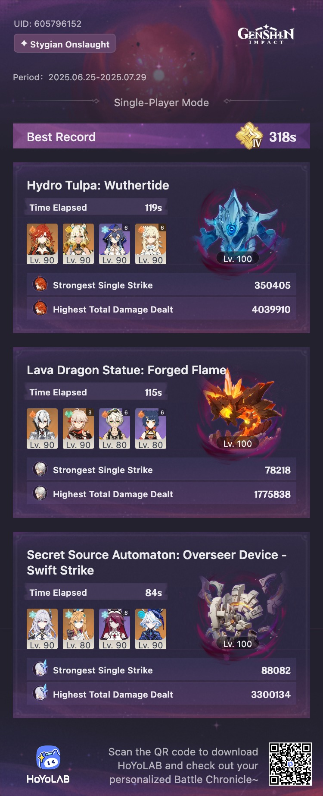

## overview

First Stygian Onslaught! I didn't manage to clear Fearless — the Tulpa gave me the most trouble. I had a hard time with the Lava Dragon, too, until I got Emilie. I think if I had worked at it a while longer, I could have done Fearless, but I kind of forgot about it and then it was over.

My initial thoughts on this game mode: I don't like how impossible it feels to clear Fearless without the newest limited characters (or otherwise *very* high-cost teams), but I really enjoyed it despite that. It's a lot easier to retry a stage over and over again with different teams and builds than it is in Abyss, which meant that locking in for hours trying to beat Fearless Overseer with Arlecchino instead of Skirk and Escoffier was actually a fun challenge, even if I didn't manage to accomplish it in the end.
