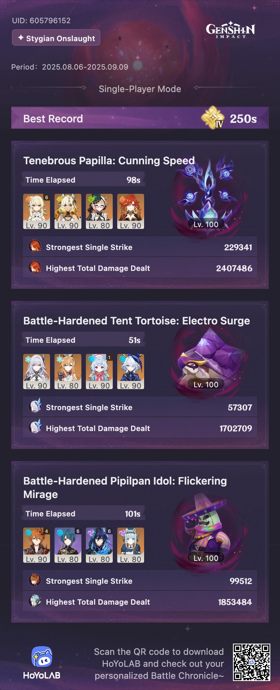

## overview

I haven't cleared Fearless yet, but I am *so* close, and I'm pretty sure I can do it. So I'll update this when I do.

The turtle is super easy with a Skirk team, and I'm pretty sure you can clear the cactus with just about anybody as long as Ineffa is there. I'll give both a try with other teams at some point to see how much more difficult it is, but for now, my real opponent is the Papilla. 

Burning shreds the Papilla's shield really well, so that was all I needed for Difficulty IV, but it's not enough for Fearless. The closest I've gotten on Difficulty V is with Mavuika, Xilonen, Iansan, and Ororon — I swear I'm one single Mavuika donut away from getting it. I crowned her burst this week *just* for this.

> [!jillian]
> Some side thoughts: I'm still enjoying this game mode despite it all, but I do think it's a little crazy that I'm struggling as much as I am with a team that has a decently-built C0R1 Mavuika, C0R1 Xilonen, Iansan on Engulfing Lightning, and Ororon on R2 Elegy. I tried to use Chasca, because she's typically pretty great for the Papilla, but it felt like she was barely sneezing on it.
