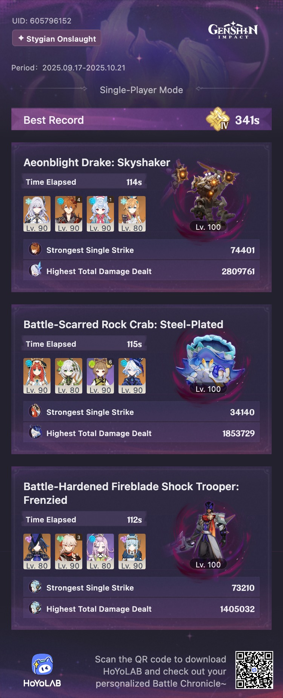

## overview

I did a quick Menacing clear, and then told myself I'd go back and try Fearless once I got Flins. And then I got lazy and just never did it. 

Getting to use Skirk and Childe together for the Aeonblight Drake was pretty fun. And Clorinde was a good stand-in for Flins against the Shock Trooper guy, as long as Ineffa and Aino were there. I had the most trouble, by far, with the crab. I'm not actually sure I would have been able to clear Fearless without Lauma — I know people have done it, though! 

I love that bloom teams are back, but I definitely need to work on mine some more to make up for not having Lauma or Nefer. Getting Nahida to level 90 is next on my list.