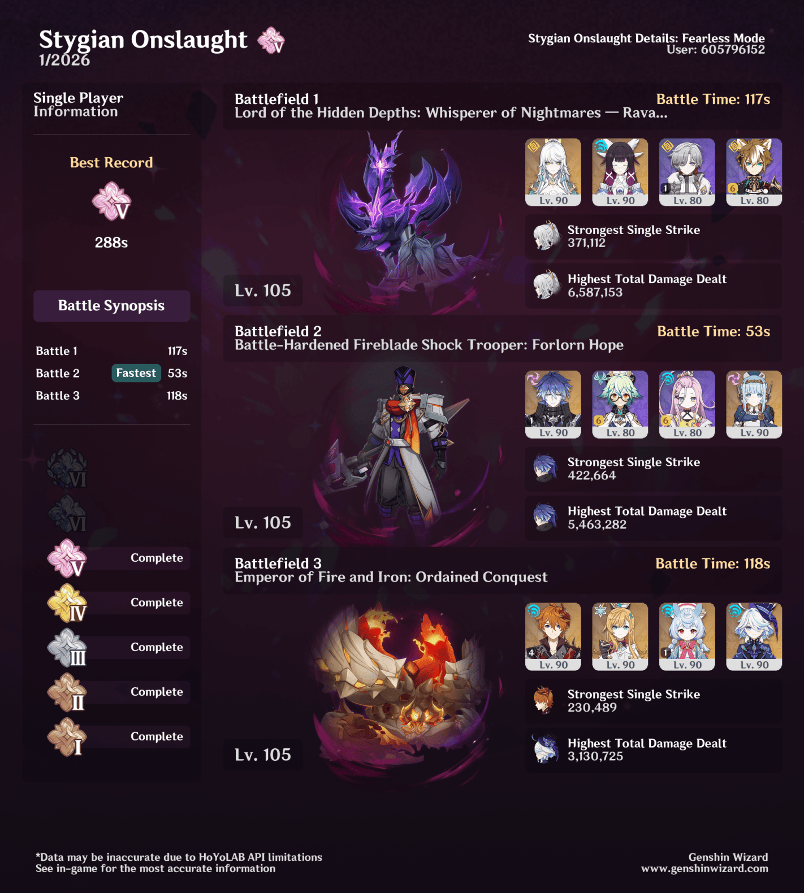

## overview

I initially tried the Zibai team with Zhongli in the last slot, but C6 Gorou was actually much better! Pretty nice that you don't even really have to build him for him to be useful.

Since I was able to use Zibai for the first stage, Flins got his full team for the second stage. Clearly it worked well — I wouldn't have gotten a sub-300s time without this team.

I admittedly thought the crab would be an easy win with Skirk, but it wasn't *at all.* That stage took me the longest, but I eventually got it by just subbing Childe into the usual Skirk team. I don't think I would have been able to do this one if Childe wasn't C4, or if I didn't have R1 Escoffier. I tried everyone on a bunch of different artifact sets, got very frustrated, and then put them all back on their normal builds — and that's what did it. Turns out I was right the first time!