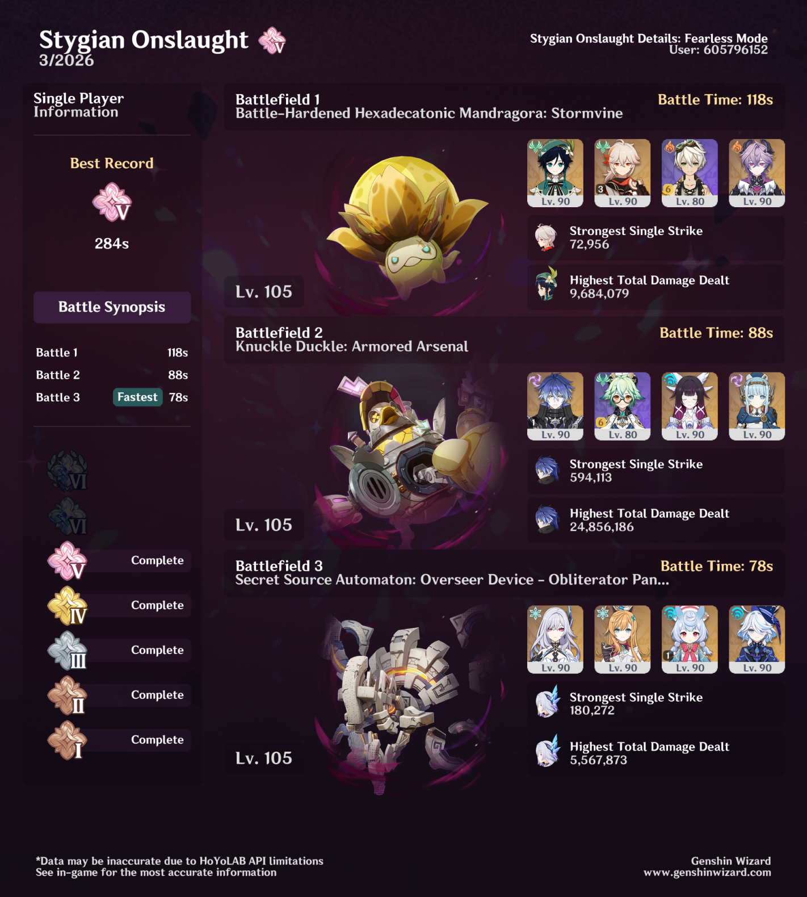

## overview

The Mandragora was the hardest for me this time around. I do have Varka, but I found it a bit easier to bring Kazuha for that extra help with grouping. It still took me several tries to get it! I kept everyone on their normal builds (Kazuha is on kind of a hybrid build with Mistsplitter), but put Varka's artifacts on Durin instead of his usual Emblem set, which helped a little bit.

Knuckle Duckle was very easy with the Flins team, nothing to note there.

The Overseer was also very easy, but the biggest surprise for me was *how much* time I saved by putting Escoffier and Furina on supportive sets instead of Golden Troupe. Putting Furina on ToTM shaved off about 10 seconds, and putting Escoffier on Scroll saved me another *20 seconds.* 

I also think it's interesting to note that this is the first Stygian Onslaught where every single character I used was exalted — except for Sigewinne, who I would never expect to be exalted. 

## video
<iframe width="560" height="315" src="https://www.youtube.com/embed/vkeGAgrX0o8?si=uhPCDIU2KErrAXPz" title="YouTube video player" frameborder="0" allow="accelerometer; autoplay; clipboard-write; encrypted-media; gyroscope; picture-in-picture; web-share" referrerpolicy="strict-origin-when-cross-origin" allowfullscreen></iframe>