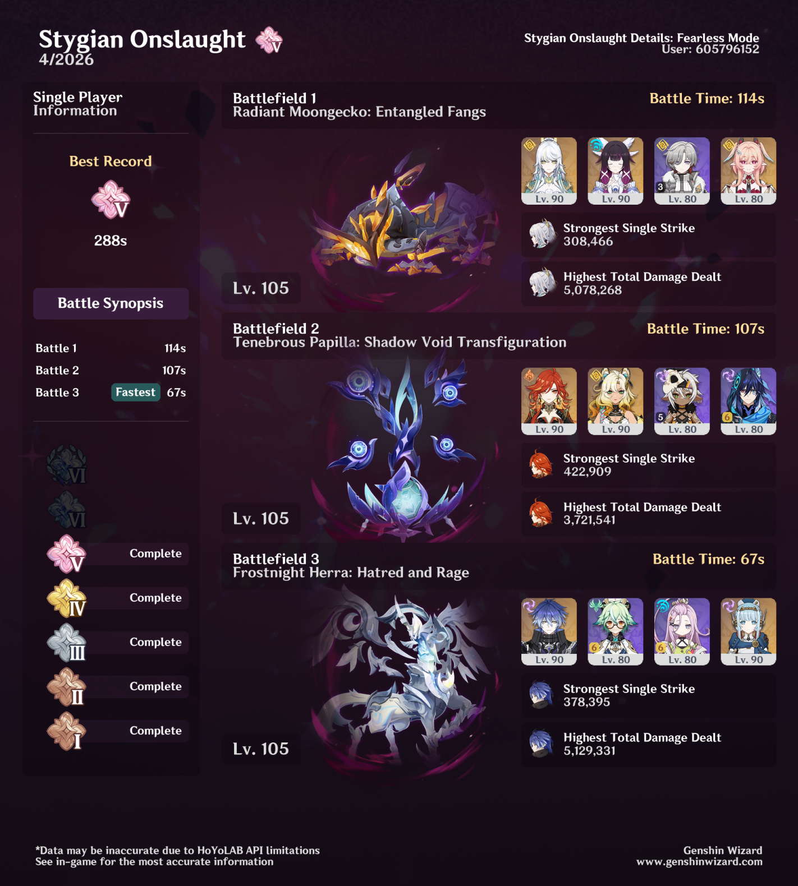

## overview

I have strong feelings about the Moongecko. I barely cleared this in time, even though I was using the exact team the boss was ostensibly designed for. Linnea actually didn't even have enough healing for me to do it until I switched her to a DEF circlet. In contrast, my Flins team cleared the Frostnight Herra in half the time.

> [!note]
> My Zibai and Flins teams have similar levels of investment. Zibai is C0R1, Columbina is C0R0, and Linnea is C0R0. Flins is C1R2, and Ineffa is C0R0 but using Shenhe's signature weapon. Obviously having C1R2 Flins makes a difference, but not so much that it should be twice as powerful as the Zibai team.

I am generally happy with the level of difficulty of Fearless bosses in Stygian Onslaught, but this one felt ridiculous to me. If you're going to design a boss that clearly heavily favors one specific team, that team should probably have an easy time beating it. If Zibai and Linnea are struggling against the Moongecko, what hope is there for any other team?

As an example, Flins and Ineffa have a really easy time against Knuckle Duckle, whether you have Columbina or Aino, and whether you have signature weapons or not. It is more difficult, but still doable, to beat the boss with other Electro-Charged teams. 

That is what I wanted the Moongecko to be — an easy clear with Zibai and Linnea, but still reasonably doable with Navia or Chiori. One thing that makes this especially hard, aside from a high HP pool, is the fact that *unlike most Fearless bosses* the Moongecko barely takes any damage when you break its ward unless that damage is Lunar Crystallize. I think changing this behavior would go a long way toward making the Moongecko feel better.

The other two bosses were fine! I brought out the same Mavuika team that I used to clear the Papilla the last time it appeared, and Flins obviously took care of the Herra with no problem. 
