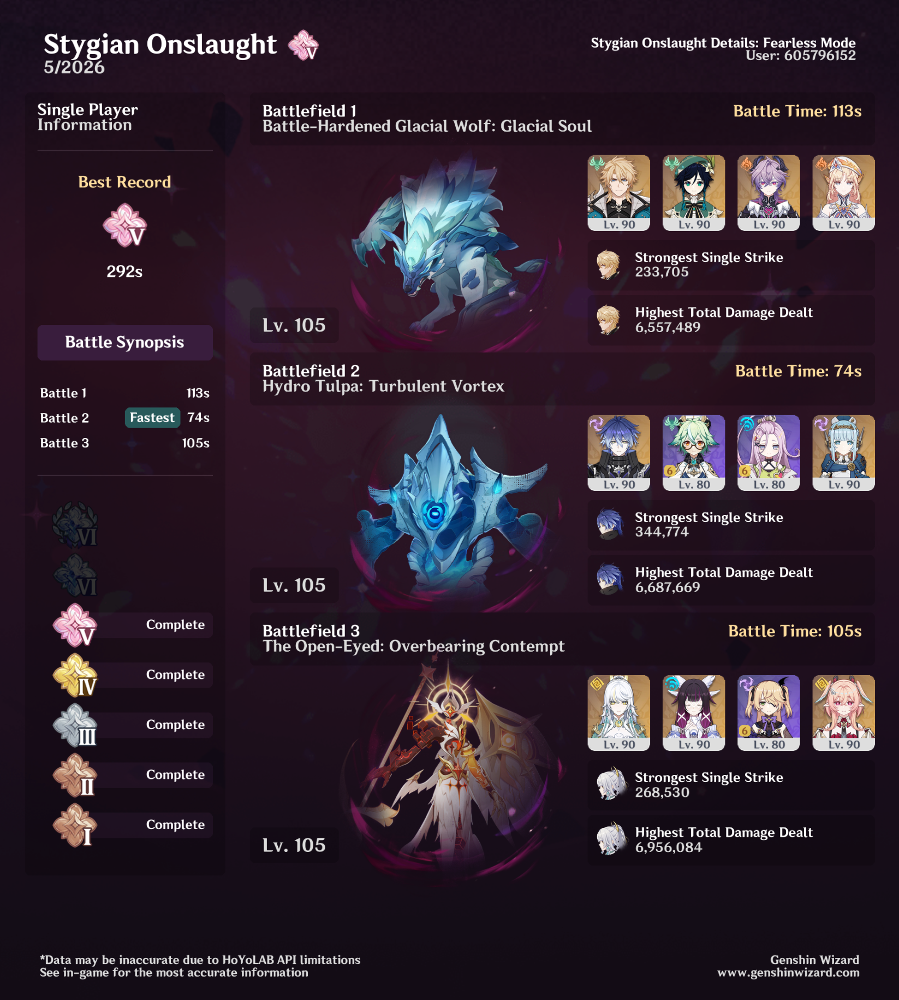

## overview

I think it's hilarious that the stage I struggled with the most here was the Glacial Wolf — which I used the "correct" team for! It took many attempts, and I tried a bunch of different team comps and a few different builds. Finally, I spent a little bit of time crowning Varka's skill and Durin's burst (both previously level 8), and that's what did it. Crown your talents!

For the Tulpa, I probably could have used Mavuika or Skirk, but Flins was clearly a good pick here. His AoE helps hit the little guys the Tulpa spawns without having to run around quite so much. 

I actually had a hard time coming up with a good team for the Open-Eyed guy, but this one was really fun. The recording phase is pretty forgiving, since the second time he records an element, it requires more hits from the element you previously recorded — so you don't really have to put a lot of effort into being particular about which element is hitting more often as long as you have two of them. And then Zibai kinda just shreds both crystals.

I liked this Stygian lineup a lot, because it didn't feel quite as much like you needed to have three very specific teams. Plenty of characters are capable of handling all three of these bosses, so there's more room for creativity. That last boss in particular is one of my favorites in a while. 