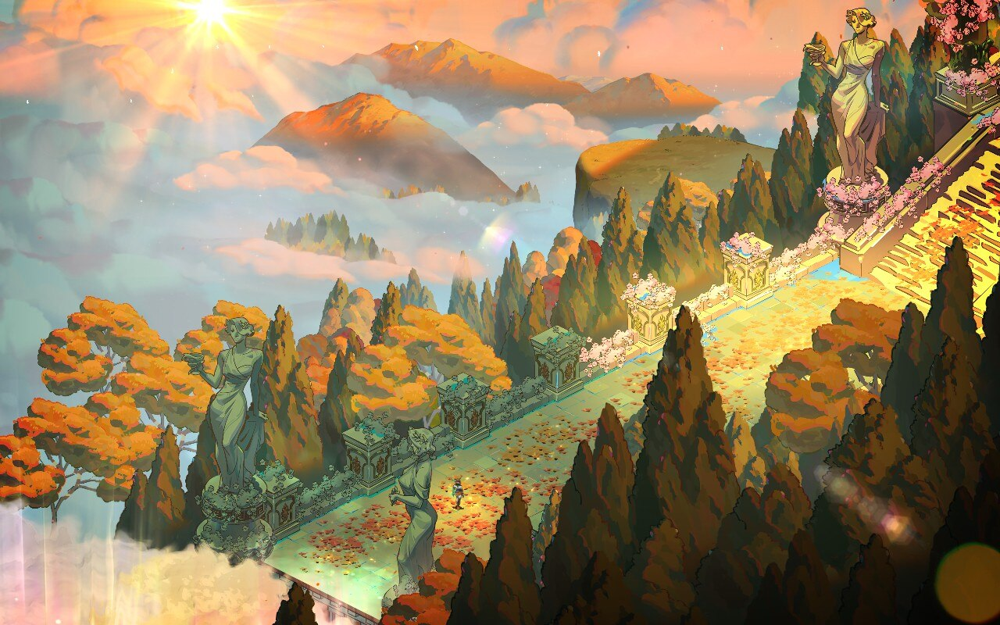
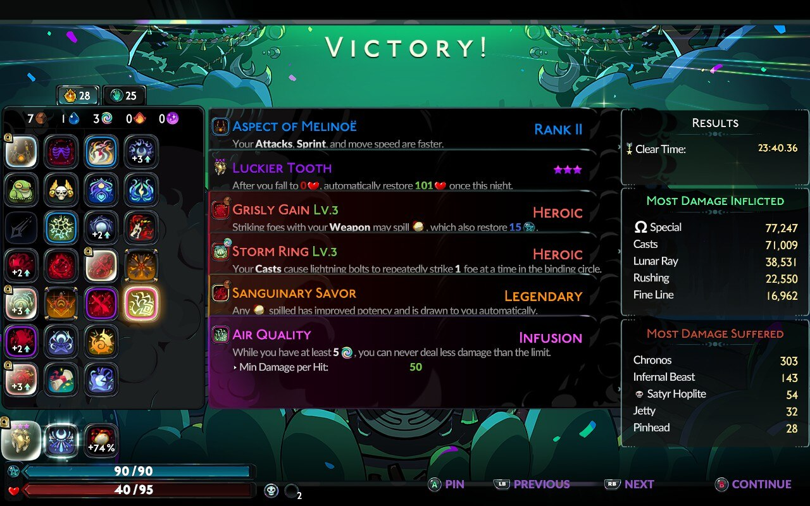
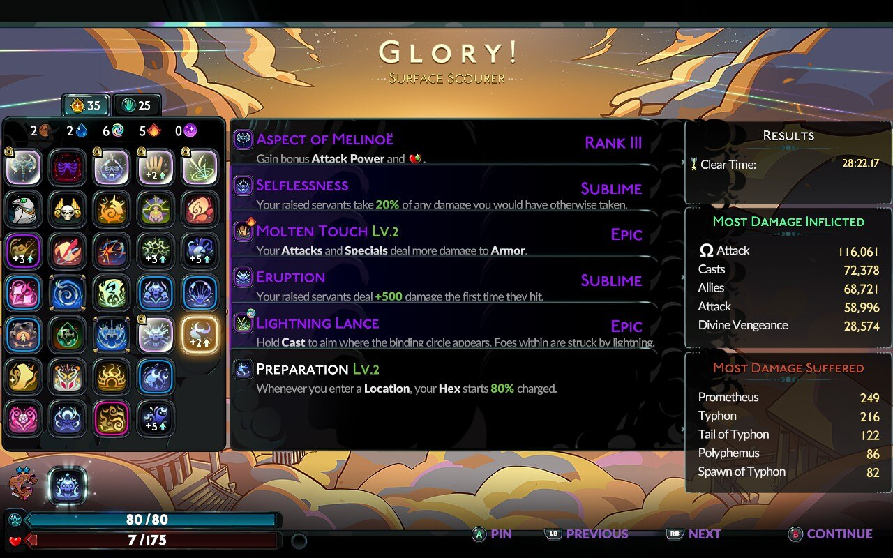

> [!NOTE]
> I haven't figured out how to add spoiler tags to my website yet! Read at your own risk.

I started playing Hades II this week! I know it's been in early access for a while, but I wanted to wait until it was out for real. I *loved* the first game, and so far I love this one just as much, if not more.

So far, I've beaten Chronos twice and gotten to Olympus once. I really like that there are two different routes you can do — I've been alternating between them most of the time, unless there are specific materials I need from one direction or the other. 

*Big* fan of the axe, but the sister blades and umbral flames are also great. I'm also really into the cast in this game, compared to Zagreus'. It's very fun to sink a bunch of boons into your cast and then just hang back and watch everything die from afar. 

> [!NOTE]
> I'm using God Mode, because I used it in the first game and it helped me a lot. I feel plenty challenged as it is, lol.

## my first clears

This is actually my second Chronos clear, because I didn't get a screenshot of the first one. It was my first time getting Aries boons, so I scooped up as many of them as I could.

I really wasn't expecting to actually clear the surface this run, but somehow I managed to hold out until the end with 7 HP left. I had a lot of fun with the axe in this one, mostly just going for the spin-to-win Ω attack.

