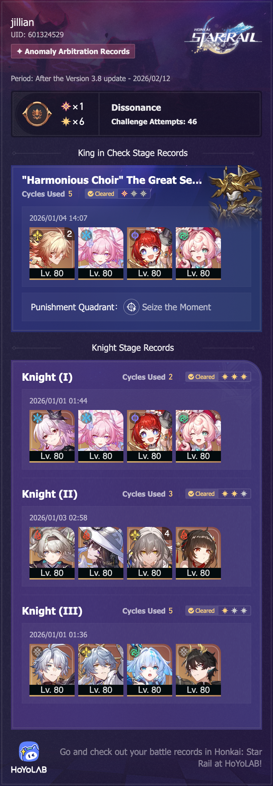

## overview

The knights were much harder for me this time. Evernight and Cyrene can still do everything no problem, but even with The Dahlia I couldn't get three stars with the Firefly team — maybe if I had Firefly's lightcone or E1 or something. And then even Phainon struggled with the third knight! But maybe that wasn't the best team to use there.

I tried a lot of different teams for the King, and couldn't get past one star with any of them. Mydei, Evernight, and Firefly all did just about the same there. Just like last time, I'm *really* close to being able to clear with two stars, but I just couldn't get over the edge.