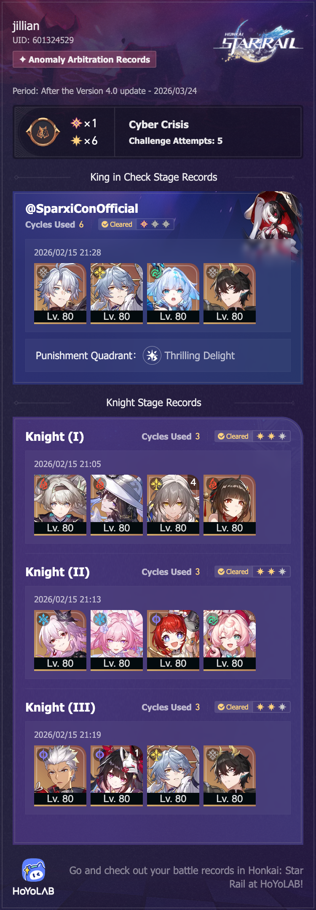

## overview

I think I enjoyed this one more than the last one — I got an even three cycles on every knight (which is a little annoying, because it means I'm *really* close to getting three stars on all of them) and my usual one star on the king. 

I'm happy I was able to do as well with the Archer team as I did with Firefly and Evernight. E1 Sparkle with her new buffs has made a big difference.