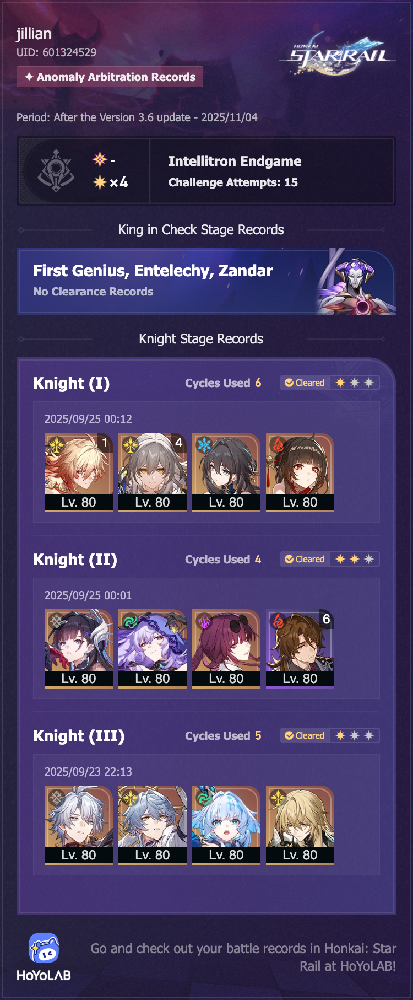

## overview

This new game mode is *so* hard. But the rewards are purely cosmetic, so I don't really mind having trouble with it. 

I still haven't managed to actually beat the King, but I did at least clear all three knights with at least one star each. The DoT stage was the easiest — that's somehow my strongest team right now, even though I don't have any eidolons or signature light cones on the five-stars.

There's also clearly something wrong with my Firefly, because using Mydei for the first Knight was much easier. Maybe because he's E1S1 and she's E0S0.

