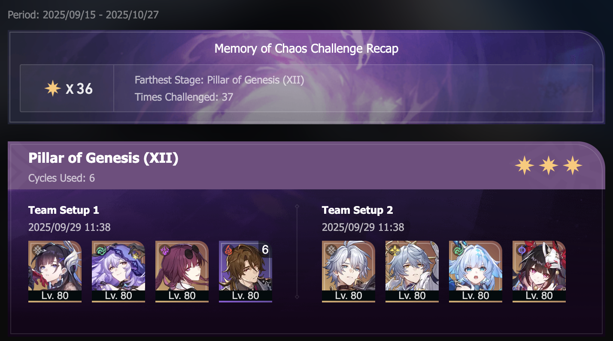

## overview

(I promise I did actually get three stars here, but the graphic hasn't updated yet.)

I spent some time fixing my DoT builds for the first half, and now that team does really well. Very fun to play, too. And yeah, you need quite a few limited five-stars, but this team also holds up really well without any eidolons or signature light cones. 

Playing Phainon against Zandar was hilarious — I just set him up to do a bunch of counters, and then he gets to do two big nukes in a row with Cerydra's help. He was also basically permanently in his ult, so I got away with going sustainless pretty easily.