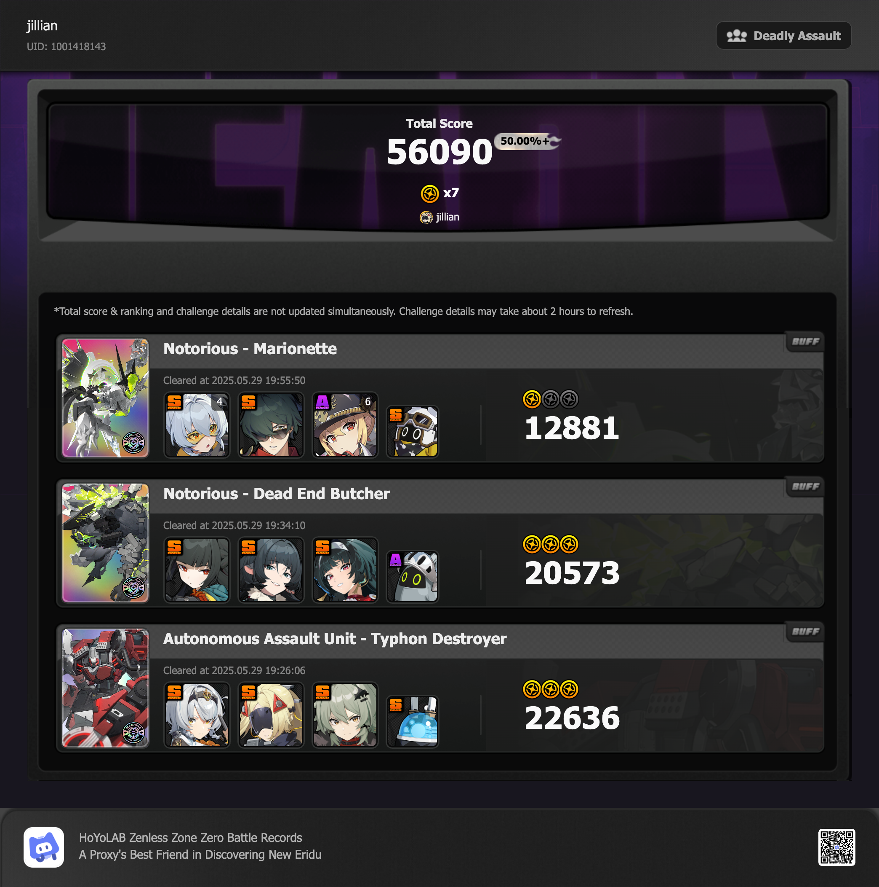

## overview

I am *so* bad at the Marionette fight. I tried with a few different teams, but eventually just decided this was good enough because I had gotten all the polychromes from the season. 

I got Jane on her rerun recently, and she's been really fun to use. I loved using her and Miyabi together! And Typhon Destroyer is always just a fun fight to me. I love doing that chain of defensive assists. 