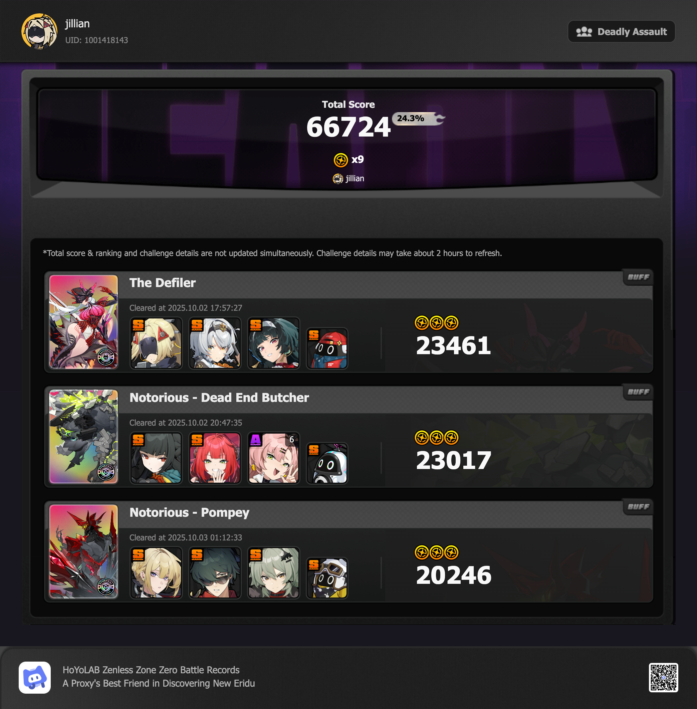

## overview

> [!NOTE]
> Haven't been playing a lot of ZZZ recently, so I've missed a few Deadly Assaults. I know there were at least a couple that I did (or attempted) and forgot to upload, but I guess I can't get the data for any of them from Hoyolab anymore.

### the defiler
The Defiler is a really fun fight, big fan. I tried using Caesar instead of Astra first, since Astra can't do defensive assists (and I wanted to use her for Dead End Butcher), but I just couldn't get there. I finally ended up getting Trigger on a King of the Summit set in the meantime, and swapped some of Sanby's pieces for a better build, so the process was worth it.

### dead end butcher
Dead End Butcher also took me a few tries, but was probably the easiest of the bunch. I always did better when I stopped worrying as much about getting more disorders and just plopped Miyabi on field to do her thing.

### pompey
I tried my best with S11, but I think I was having trouble because I usually have her on a bit of an Anomaly build for the burns — and that kept interrupting the guy's attacks, so I couldn't get as many defensive assists. 

I had already decided I wanted Evelyn when I started, and I managed to get her a few hours before the reset. I ended up just giving her S11's build ([Enka](https://enka.network/u/jillian)), scrambled to level her skills with my backup battery, and fought Pompey over and over until I finally actually learned how to play Evelyn. She's really fun! Glad I got her! Hopefully I can pull her wengine before the banner is over so I can give Brimstone back to S11.
