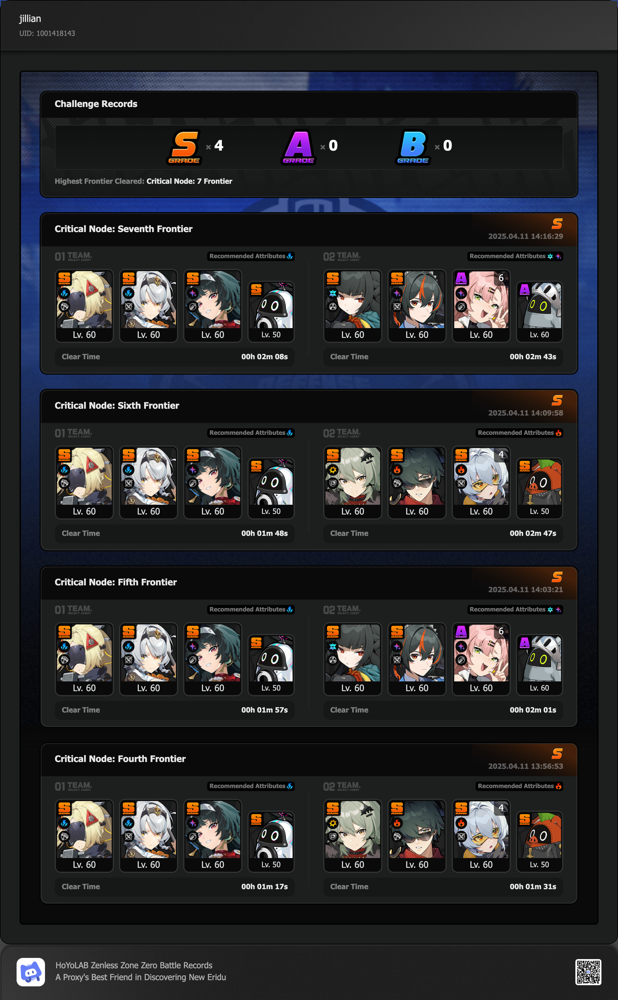

## overview

I've definitely gotten to the point where Shiyu Defense feels pretty easy (and repetitive) every time. I've got 3-4 really solid teams that I usually don't really need to deviate from. Still really enjoying Trigger + Sanby! 

Builds are on [Enka](https://enka.network/u/jillian/1nAZeP/1071/6092488/).